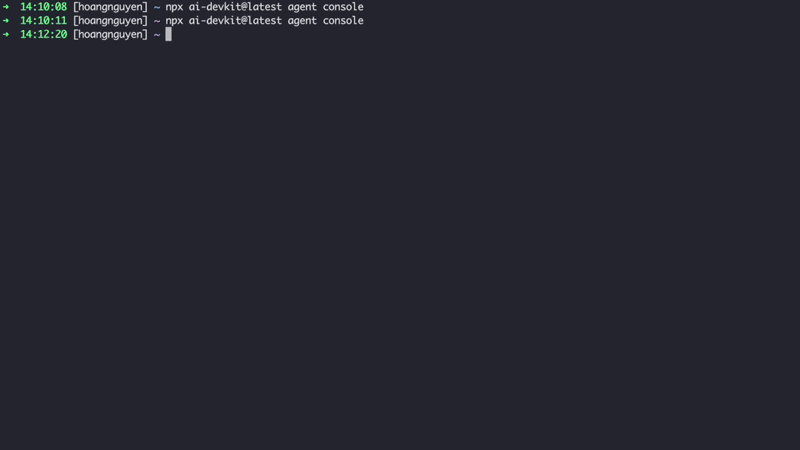

# AI DevKit

> [English](./README.md) | 中文

**你的 AI 编程智能体团队很快、很主动，也很容易鲁莽。让它们像高级工程师一样工作。**



AI DevKit 把一次性的 AI 编程聊天变成可重复的软件交付流程：需求、设计、计划、实现、测试、验证、记忆和代码审查。

- **停止 prompt-and-pray 式写代码** — `/new-requirement` 让智能体先澄清问题，再动代码
- **阻止虚假的“完成”声明** — `verify` 要求有最新的测试或构建输出
- **保留项目知识** — `@ai-devkit/memory` 跨会话保存决策、约定和修复经验
- **推送前发现偏差** — `/code-review` 按设计和需求文档审查 diff
- **一个控制台管所有智能体** — `agent console` 是一个实时 TUI 仪表盘，统一管理所有正在运行的智能体，不论来自哪个厂商

一份配置，适配所有编程智能体：Claude Code、Cursor、Codex CLI、Gemini CLI、GitHub Copilot、opencode、Antigravity、Amp、Windsurf、Kilo Code、Roo Code。

运行 `npx ai-devkit@latest init` 后，你的智能体会获得：

| 你需要的能力 | AI DevKit 安装的内容 |
|-------------|----------------------|
| 写代码前先有计划 | `/new-requirement`、`/review-design`、`/execute-plan` |
| 说“完成”前先有证据 | 绑定最新测试/构建输出的 `verify` 门禁 |
| 跨会话记忆 | 通过 MCP 和 CLI 暴露的本地 SQLite 记忆 |
| 跨智能体一致行为 | 为团队使用的编程工具生成配置 |

[](https://www.npmjs.com/package/ai-devkit)
[](https://www.npmjs.com/package/ai-devkit)
[](https://github.com/Codeaholicguy/ai-devkit)
[](https://opensource.org/licenses/MIT)

## 适合谁

适合每天使用 AI 编程智能体，并且厌倦这些问题的开发者：

- 每个项目都要重新维护 `CLAUDE.md` / `.cursor/rules` / `AGENTS.md`
- 智能体忘记昨天已经确定的项目约定
- 构建还是红的，智能体却说“功能已经成功实现”
- 智能体没有计划就直接改代码，最后实现了错误的东西

没有 AI DevKit 时，你的智能体是一个有能力但不稳定的聊天机器人。有了 AI DevKit，它会带着工作流、记忆、验证门禁和可复用技能随项目一起工作。

| 没有 AI DevKit | 使用 AI DevKit |
|----------------|----------------|
| 你在每次聊天里重复项目规则 | 智能体先搜索项目记忆和文档 |
| 智能体从提示词直接跳到代码 | 智能体先经过需求、设计和计划 |
| “完成”只是智能体停止编辑 | “完成”需要最新验证输出 |
| 每个智能体都要手动维护一套规则 | 一份配置协调命令、技能和 MCP 设置 |

## 30 秒开始

```bash
npx ai-devkit@latest init
```

一个向导。选择你的智能体，安装工作流，让它们使用同一套工作模型。它写入的是项目本地文件，你可以审查并提交。智能体列表或工作流变化时，可以重新运行。

初始化后，你的项目会获得：

```text
your-project/
├── .ai-devkit.json              # 单一配置源，可以反复运行 init 更新
├── .claude/                     # 或 .cursor/、.codex/ 等你选择的智能体目录
│   ├── skills/                  # dev-lifecycle、verify、memory、tdd 等
│   ├── commands/                # /new-requirement、/execute-plan、/code-review 等
│   └── settings.json            # MCP 服务配置，包括 @ai-devkit/memory
└── docs/ai/
    ├── requirements/            # 阶段 1：要构建什么，为什么构建
    ├── design/                  # 阶段 2：如何实现
    ├── planning/                # 阶段 3：任务拆解和执行计划
    ├── implementation/          # 阶段 4：实现记录
    └── testing/                 # 阶段 5：测试策略
```

### 或安装完整工程工作流栈

把 [`templates/senior-engineer.yaml`](./templates/senior-engineer.yaml) 保存到本地，然后运行：

```bash
ai-devkit init --template ./senior-engineer.yaml
```

它把八个内置技能与来自 Anthropic、Vercel 等来源的精选技能组合在一起，包括 TDD、前端设计、Web 应用测试、文档协作、React 最佳实践、安全审查等。

## 一个功能，从头到尾

```text
你：    /new-requirement add OAuth login with Google

智能体：搜索记忆里已有的认证约定。询问范围、用户、成功标准等
        澄清问题。创建
        docs/ai/{requirements,design,planning}/feature-oauth-login.md
        到功能 worktree。停止，不直接写代码。

你：    /review-design feature-oauth-login

智能体：按需求文档审查设计文档。发现缺口，提出修复建议，
        在任何代码写入前处理问题。

你：    /execute-plan feature-oauth-login

智能体：按 planning 文档逐项执行任务。每完成一项就更新进度。
        `verify` 技能会阻止没有最新测试/构建输出的任务被标记完成。

你：    /code-review

智能体：按设计文档审查 diff，包括范围膨胀、缺失测试、
        需求中提到的边界情况，然后你再推送。
```

## 智能体会发生什么变化

上面的流程由八个内置技能驱动，每个技能都对应真实 AI 编程会话中的一个失败模式：

| 失败模式 | AI DevKit 的行为 |
|----------|------------------|
| 智能体过早开始写代码 | `dev-lifecycle` 强制经过需求、设计、计划、实现、测试和审查 |
| 智能体没有证据就说“完成” | `verify` 阻止没有最新测试/构建证据的完成声明 |
| 智能体忘记项目决策 | `memory` 提供跨会话、跨项目的本地可搜索知识库 |
| 新行为没有测试就上线 | `tdd` 推动测试优先实现 |
| 调试变成猜测和乱改 | `structured-debug` 要求复现、假设、修复和验证 |
| 现有代码不透明 | `document-code` 映射入口点、依赖和行为 |
| 实现变得臃肿 | `simplify-implementation` 在代码发布前降低复杂度 |
| 文档难以理解 | `technical-writer` 按新手用户清晰度审查文档 |

需要更多能力？`ai-devkit skill add <registry> <skill>` 可以从 30+ 发布方拉取技能，包括 Anthropic、Vercel、Supabase、Microsoft、Google。

## 适配所有编程智能体

一份 `.ai-devkit.json` 配置全部智能体。团队新增智能体时，不需要重写规则。

| 智能体 | 配置支持 | 远程控制 |
|--------|----------|----------|
| [Claude Code](https://www.anthropic.com/claude-code) | yes | yes |
| [Gemini CLI](https://github.com/google-gemini/gemini-cli) | yes | yes |
| [Codex CLI](https://github.com/openai/codex) | yes | yes |
| [opencode](https://opencode.ai/) | yes | testing |
| [Cursor](https://cursor.sh/) | yes | — |
| [GitHub Copilot](https://code.visualstudio.com/) | yes | — |
| [Antigravity](https://antigravity.google/) | yes | — |
| [Amp](https://ampcode.com/) | yes | — |
| [Windsurf](https://windsurf.com/) | testing | — |
| [Kilo Code](https://github.com/Kilo-Org/kilocode) | testing | — |
| [Roo Code](https://roocode.com/) | testing | — |

**配置支持** — `ai-devkit init` 写入智能体配置，包括规则、MCP 服务、技能和斜杠命令，让它遵循同一套工作流。
**远程控制** — 通过 `ai-devkit agent send` 驱动运行中的会话，并把它们接入外部渠道。

## 像基础设施一样操作智能体

AI DevKit 还带有智能体控制面，可以从 CLI 驱动会话，并在任何地方监督它：

```bash
# 列出跨提供方运行中的会话
ai-devkit agent list

# 向运行中的会话发送提示词，并等待响应
ai-devkit agent send <session-id> "run the tests and report back" --wait

# 通过 Telegram 接入会话，从手机操作智能体
ai-devkit channel start telegram
```

适合长时间任务、计划任务，或在离开电脑时检查智能体进展。

## 与 `CLAUDE.md`、`.cursor/rules`、`AGENTS.md` 有什么不同？

这些文件是智能体反复读取的静态说明。AI DevKit 提供的是**工作流层**：阶段文档、斜杠命令、按需加载的技能、本地可搜索记忆、验证门禁，以及跨智能体工作的控制面。规则仍然重要，但 AI DevKit 让规则可以被执行。

| 静态规则文件 | AI DevKit |
|--------------|-----------|
| 告诉智能体你偏好什么 | 安装驱动下一步的命令 |
| 依赖智能体记住每条规则 | 存储并搜索可复用项目知识 |
| 不能证明任务已经完成 | 要求最新命令输出才能声明完成 |
| 每个智能体的写法都不同 | 为每个支持的智能体生成正确文件 |

## 这不是什么

- **不是更聪明的 LLM。** 差的模型仍然差。AI DevKit 提升的是流程下限，不是模型原始能力。
- **不是“帮我自动写完整功能”的魔法按钮。** 你仍然要审查需求文档、接受设计、阅读 diff。工作流让这种审查变得可行，因为你有可以指向的工件，而不是只能翻聊天记录。
- **不是托管服务。** MIT 许可，本地运行，没有遥测。记忆是你磁盘上的 SQLite 文件。智能体控制面与已经在使用的智能体 SDK 通信。

## 文档与社区

- 完整指南、工作流模式、技能编写 → **[ai-devkit.com/docs](https://ai-devkit.com/docs/)**
- 发布记录 → **[CHANGELOG.md](./CHANGELOG.md)**
- 贡献指南 → **[CONTRIBUTING.md](./CONTRIBUTING.md)**

```bash
git clone https://github.com/Codeaholicguy/ai-devkit.git
cd ai-devkit && npm install && npm run build
```

## 许可证

MIT
