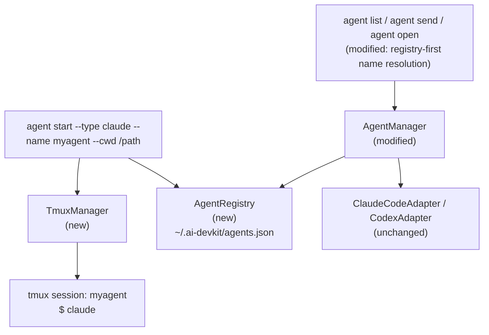

# System Design & Architecture

## Architecture Overview



**`agent start` flow (happy path):**
1. Validate `--name` format, tmux availability, `--cwd` exists, name not live in registry
2. `TmuxManager.createSession(name, cwd)` — `tmux new-session -d -s <name> -c <cwd>`
3. `TmuxManager.sendKeys(name, agentCommand)` — `tmux send-keys -t <name> "<cmd>" Enter`
4. Poll up to 5s (500ms interval) via `TmuxManager.findAgentPid(name, type)` for the agent process PID (walks the process tree to skip wrapper scripts)
5. `AgentRegistry.register({ name, pid, type, tmuxSession: name, cwd, startedAt })`
6. Print success output with attach command

**`agent start` flow (PID poll timeout):**
- If no child PID is found within 5s: `tmux kill-session -t <name>`, exit non-zero with message "Agent process not found — verify `<cmd>` is in PATH"
- No orphaned tmux sessions left behind

**`agent list` / `agent send` / `agent open` flow:**
- `AgentManager.listAgents()`: aggregate adapter results → overlay registry names by PID equality
- `AgentManager.resolveAgent(input, agents)`: registry lookup by name first → fall through to exact/partial name match

## Data Models

### Registry entry (`~/.ai-devkit/agents.json`)

```typescript
interface RegistryEntry {
  name: string;        // user-supplied, unique key
  type: AgentType;     // 'claude' | 'codex' | 'gemini_cli' | 'opencode'
  pid: number;         // agent process PID
  tmuxSession: string; // tmux session name (== name for `agent start` entries)
  cwd: string;         // resolved absolute path
  startedAt: string;   // ISO 8601
}

type RegistryFile = { entries: RegistryEntry[] };
```

**Identity = PID.** Liveness check is `process.kill(pid, 0)`. Simple, single-tier.

**Known limitation**: if the agent process restarts inside its tmux pane (e.g., user hits Ctrl+C and re-runs the binary), the stored PID is dead and the registry entry will be pruned. The pane and the new process are still there — the registry just loses the name. Recovery: `tmux kill-session -t <name>` and run `agent start` again. Acceptable trade-off for v1 simplicity.

**Registering the right PID**: the direct child of the tmux shell is often an npm bin shim or shell wrapper that `exec`s/forks into the real node process and exits. To avoid registering a wrapper PID that dies seconds later, `TmuxManager.findAgentPid` walks the process tree and prefers a descendant whose `comm` matches the agent type.

`prune()` removes entries that fail `isAlive`. Not load-bearing for correctness (every consumer guards stale entries via PID equality), so it runs opportunistically.

## API Design

### `TmuxManager` (new — `packages/agent-manager/src/terminal/TmuxManager.ts`)

```typescript
class TmuxManager {
  isAvailable(): Promise<boolean>
  sessionExists(name: string): Promise<boolean>
  createSession(name: string, cwd: string): Promise<void>
  sendKeys(session: string, keys: string): Promise<void>
  killSession(name: string): Promise<void>
  findAgentPid(session: string, matches: (psCommand: string) => boolean): Promise<number | null>
}
```

- `createSession`: `tmux new-session -d -s <name> -c <cwd>`
- `sendKeys`: `tmux send-keys -t <session> <keys> Enter`
- `findAgentPid`: BFS walks the process tree from the pane's shell PID and returns the **deepest** descendant whose `ps` command line is accepted by the caller-supplied `matches` function. The "deepest match" rule handles both wrapper scripts above the agent and helper subprocesses (e.g. MCP servers) below it. `TmuxManager` is generic — agent-type knowledge lives in the matcher.

### `AGENTS` registry (new — `packages/agent-manager/src/utils/agents.ts`)

```typescript
export type StartableAgentType = Exclude<AgentType, 'other'>;

export interface AgentConfig {
  command: string;                              // shell command sent to tmux
  matches: (psCommand: string) => boolean;      // identifies the process in `ps` output
}

export const AGENTS: Record<StartableAgentType, AgentConfig> = {
  claude:     { command: 'claude',   matches: matchArgv0('claude') },
  codex:      { command: 'codex',    matches: matchArgv0('codex') },
  opencode:   { command: 'opencode', matches: matchArgv0('opencode') },
  gemini_cli: { command: 'gemini',   matches: matchAnyToken('gemini') },
};
```

Each agent owns both its launch command and a matcher that knows that agent's distribution quirks. Most agents ship as npm bin shims where `argv[0]` is the executable name (`matchArgv0`). Gemini ships as a Node script, so `ps` shows it as `node /path/to/gemini ...` and the real binary basename lives in `argv[1..]` — `matchAnyToken` scans every token.

### `AgentRegistry` (new — `packages/agent-manager/src/utils/AgentRegistry.ts`)

```typescript
class AgentRegistry {
  register(entry: RegistryEntry): void
  lookup(name: string): RegistryEntry | null
  list(): RegistryEntry[]
  prune(): void
  isAlive(entry: RegistryEntry): boolean  // kill(pid, 0)
}
```

Path: `~/.ai-devkit/agents.json`. Creates directory/file if absent. Writes are atomic (write to `.tmp` then rename).

**Concurrent access:** two simultaneous `agent start` calls with the same `--name` may both pass the name-free check before either writes. This is an acceptable edge case (rare, self-correcting on next prune). File locking is not implemented in this iteration.

### CLI subcommands (`packages/cli/src/commands/agent.ts`)

```
agent start
  --type <type>    required  'claude' | 'codex' | 'gemini_cli' | 'opencode'
  --name <name>    optional  alphanumeric + hyphens, max 64 chars; default: {folder}-{timestamp}
  --cwd  <path>    optional  defaults to process.cwd()
```

**Output on success:**
```
Agent "myagent" started (claude, PID 12345)
Working directory: ~/projects/myapp
Attach: tmux attach -t myagent
```

### `AgentManager` modifications

**Constructor injection:**
```typescript
class AgentManager {
  constructor(private registry: AgentRegistry = AgentRegistry.default()) {}
}
```
`AgentRegistry.default()` returns a module-level singleton backed by the default path `~/.ai-devkit/agents.json`. Tests can inject a custom instance.

**`listAgents()`:** after aggregating adapter results, for each `AgentInfo` whose `pid` matches a registry entry, override `info.name` with the registry name.

**`resolveAgent(input, agents)`:** before exact/partial name matching, check `registry.lookup(input)`; if found and its PID appears in the agent list, return that agent.

**`createAgentManager()` CLI helper** passes `AgentRegistry.default()` explicitly to ensure the same instance is used across `agent start`, `agent list`, and `agent send` within a process lifetime.

## Component Breakdown

| Component | Location | Change |
|---|---|---|
| `TmuxManager` | `packages/agent-manager/src/terminal/TmuxManager.ts` | New |
| `AgentRegistry` | `packages/agent-manager/src/utils/AgentRegistry.ts` | New |
| `AGENTS` registry | `packages/agent-manager/src/utils/agents.ts` | New |
| `agent start` subcommand | `packages/cli/src/commands/agent.ts` | New subcommand |
| `AgentManager.listAgents()` | `packages/agent-manager/src/AgentManager.ts` | Registry name overlay by PID |
| `AgentManager.resolveAgent()` | `packages/agent-manager/src/AgentManager.ts` | Registry-first lookup |
| `packages/agent-manager/src/index.ts` | exports | Export new classes and `AGENTS` |
| `createAgentManager()` (CLI helper) | `packages/cli/src/commands/agent.ts` | Pass registry instance |

## Design Decisions

**Registry over adapter modification:** Agent detection adapters are intentionally decoupled from identity management. Injecting the registry overlay into `AgentManager` (not adapters) keeps adapters stateless and testable.

**Name = tmux session name:** Keeping them identical simplifies lookup and the `tmux attach -t <name>` hint.

**Walk the process tree to find the real agent PID:** The shell's direct child is often an npm bin shim or shell wrapper that exits after spawning the real node process, AND the real agent may itself spawn helper subprocesses (e.g. MCP servers). `findAgentPid` BFS-walks descendants and returns the **deepest** descendant whose `ps` command line passes the per-agent matcher. This handles both shapes uniformly. Without it, the registered PID is either the dead wrapper or a transient helper child.

**PID-only identity (deferred: pane-based identity):** The simplest design that works. Trade-off: if the user kills and re-runs the agent inside the same tmux pane, the registry entry becomes stale (its stored PID is dead). User recovers by killing the tmux session and re-running `agent start`. A future iteration can add `paneId` to the schema for in-pane restart resilience and to enable an `agent name` command for labeling existing agents.

**Atomic registry writes:** Prevents corrupt JSON if the process is killed mid-write.

**`--type` allowlist at CLI:** Accepted types are the keys of `AGENTS` (exported from `agent-manager`). Each entry pairs a launch command with a `ps`-output matcher. No shell interpolation of user input.

**`pgrep` dependency:** `pgrep -P <pid>` is used by `findAgentPid` to walk the process tree. `pgrep` is available on macOS (built-in) and Linux (via `procps`). Soft dependency — if absent, `agent start` will fail at the PID poll step with a clear error.

**1 session = 1 agent:** each `agent start` creates one dedicated tmux session named after the agent. Sessions are independent — killing one does not affect others. This is the confirmed model (vs. shared session with windows).

## Non-Functional Requirements

- Registry reads/writes complete in <50ms (local file, small JSON)
- `agent start` completes (session created + process detected) in <3s on a typical machine
- No new external runtime dependencies (tmux is a system tool, not an npm package)
- Name validation: `/^[a-z0-9][a-z0-9-]{0,62}[a-z0-9]$/` (lowercase alphanumeric + hyphens, 2-64 chars) to be safe as tmux session names
