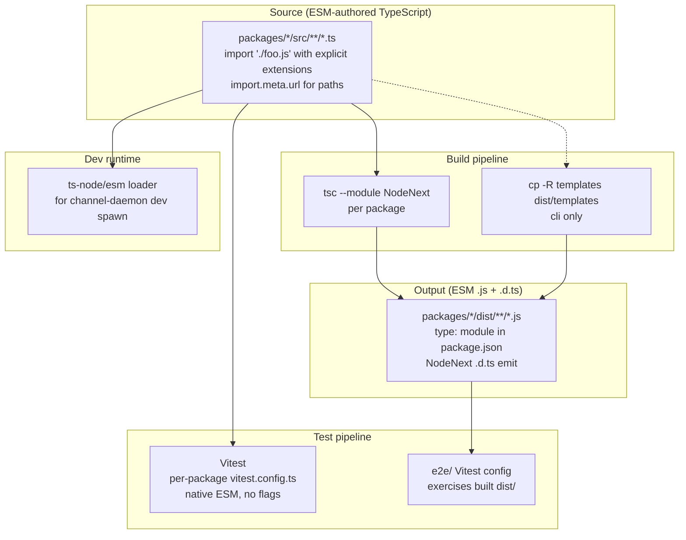

# System Design & Architecture

## Architecture Overview

This migration changes the **module system and build emit** of the monorepo. No runtime architecture or domain logic changes. The "system" being designed here is the build/dev/test pipeline.



**Components touched**

| Surface | Change |
|---|---|
| `tsconfig.base.json` | `module: NodeNext`, `moduleResolution: NodeNext`, `target: ES2022` |
| `packages/*/package.json` | Add `"type": "module"`; bump `typescript` to `^5.5.0` |
| `packages/*/tsconfig.json` | Remove per-package `module`/`moduleResolution` overrides (inherit base) |
| `packages/*/src/**/*.ts` | Add `.js` extensions to all relative imports; replace `__dirname`/`__filename`/`require()` with ESM equivalents |
| `packages/memory/src/database/connection.ts` | Convert lazy `require('./schema')` → top-level `import { initializeSchema } from './schema.js'` (type-only cycle, no runtime cycle) |
| `packages/cli/src/commands/channel.ts` | Replace `createRequire` + `__filename`/`__dirname` with `import.meta.url` + `fileURLToPath`; update `ts-node` invocation to `ts-node/esm` loader for `.ts` dev spawn |
| `packages/cli/src/cli.ts` | Replace `require('../package.json')` with `import pkg from '../package.json' with { type: 'json' }` |
| `packages/cli/src/lib/TemplateManager.ts` | Replace `__dirname` with `fileURLToPath(import.meta.url)` |
| `packages/memory/src/database/schema.ts` | Replace `__dirname` with `fileURLToPath(import.meta.url)` |
| `packages/*/jest.config.js` → `vitest.config.ts` | Per-package Vitest config |
| `packages/*/package.json` scripts | `jest` → `vitest run`; `jest --watch` → `vitest`; `jest --coverage` → `vitest run --coverage` |
| `packages/*/src/**/__tests__/**/*.test.ts` | Codemod `jest.*` → `vi.*`; 4 manual fix-ups for `jest.requireActual` → `await vi.importActual()` |
| `e2e/jest.config.js` → `e2e/vitest.config.ts` | Same treatment |
| Remove deps | `jest`, `@types/jest`, `ts-jest`, `@swc/jest` |
| Add deps | `vitest`, `@vitest/coverage-v8` |
| `.eslintrc` (if present) | Disable `import/extensions` or set to `"ignorePackages"` |

## Data Models

Not applicable — no schema or persistence changes.

The only data-shape concern is the `package.json` shape on disk:

```jsonc
// packages/*/package.json
{
  "type": "module",            // NEW
  "main": "dist/index.js",     // unchanged (now ESM-shaped)
  "types": "dist/index.d.ts",  // unchanged
  "exports": {                 // unchanged structure; verify entries resolve under NodeNext
    ".": {
      "import": "./dist/index.js",
      "types": "./dist/index.d.ts"
    }
  }
}
```

`packages/cli` additionally keeps its `"bin"` field; the shebang file `dist/cli.js` already starts with `#!/usr/bin/env node` and runs as ESM under `"type": "module"`.

## API Design

No external API changes. Internal module API stays the same (named exports preserved).

**Import-form conventions** (project-wide post-migration):

| From | To |
|---|---|
| `import x from './y'` | `import x from './y.js'` |
| `import { z } from '../foo'` | `import { z } from '../foo.js'` |
| `import x from '../package.json'` | `import x from '../package.json' with { type: 'json' }` |
| `require('./schema')` (lazy) | `import { initializeSchema } from './schema.js'` (top-level — type-only cycle is erased) |
| `__dirname` | `path.dirname(fileURLToPath(import.meta.url))` |
| `__filename` | `fileURLToPath(import.meta.url)` |
| `createRequire(__filename)` | `createRequire(import.meta.url)` (when truly needed; we have none after migration) |

## Component Breakdown

### Per-package migration order (phased)

1. **`packages/memory`** (pilot)
   - Smallest, fewest CJS-isms (2: `__dirname` in `schema.ts`, lazy `require` in `connection.ts`).
   - Validates: tsconfig changes, NodeNext type emit, Vitest config, mock codemod, `.js` extension churn.
   - **Exit criteria**: build + test + workspace consumers (`agent-manager`, `cli`) still build against unchanged consumer CJS code (yes — Node ESM can import CJS workspace deps that are ESM-published; we're not breaking interop because consumers also flip after).

2. **`packages/channel-connector`**
   - No CJS-isms in production code; tests-only mocks.
   - Straightforward.

3. **`packages/agent-manager`**
   - Heaviest test suite (most `jest.mock` sites). Validates codemod at scale.
   - No production CJS-isms.

4. **`packages/cli`** (last)
   - Most production CJS-isms: `TemplateManager.ts` (`__dirname`), `channel.ts` (dual-mode spawn), `cli.ts` (JSON require).
   - Done last so we already have confidence in the test/build pipeline.

5. **`e2e/`**
   - Exercises built `dist/`. Migrated alongside whichever package it tests against first (likely with `cli`).

### Test framework swap (Vitest)

- **Mock codemod**: `jest.fn|mock|spyOn|clearAllMocks|restoreAllMocks|useFakeTimers|advanceTimersByTime|useRealTimers|doMock` → `vi.<same>`. Single sed-style pass per package.
- **`jest.requireActual` (4 spots)** → manual: change to `const actual = await vi.importActual<typeof import('./y.js')>('./y.js')`. Test function must be `async` if not already.
- **Globals**: enable `globals: true` in each `vitest.config.ts` so `describe`/`it`/`expect` need no imports (matches current Jest ergonomics).
- **Coverage**: `@vitest/coverage-v8` with same 80% thresholds. V8 coverage numbers may differ slightly from Istanbul; **accept any threshold drop ≤2% as a tolerance** rather than rewriting tests.
- **Per-package configs**: each `vitest.config.ts` mirrors current `jest.config.js` layout. No workspace mode.

### Dev daemon spawn (`channel.ts`)

```ts
// Before (CJS, dual-mode):
const nodeRequire = createRequire(__filename);
if (path.extname(__filename) === '.ts') {
  spawn('ts-node', [path.resolve(__dirname, '..', 'channel-daemon.ts'), ...]);
} else {
  spawn(process.execPath, [path.resolve(__dirname, '..', 'channel-daemon.js'), ...]);
}

// After (ESM, dual-mode preserved):
const __filename = fileURLToPath(import.meta.url);
const __dirname = path.dirname(__filename);
const isDev = path.extname(__filename) === '.ts';
if (isDev) {
  spawn(process.execPath, [
    '--import', 'ts-node/register/esm',  // or 'tsx' if ts-node/esm proves flaky
    path.resolve(__dirname, '..', 'channel-daemon.ts'),
    ...args
  ]);
} else {
  spawn(process.execPath, [path.resolve(__dirname, '..', 'channel-daemon.js'), ...args]);
}
```

Add `"ts-node": { "esm": true, "experimentalSpecifierResolution": "node" }` block to `packages/cli/tsconfig.json` (only consulted when ts-node is the runtime).

### Memory `connection.ts` cleanup

The current lazy `require('./schema')` is documented as breaking a "circular dependency," but inspection shows `schema.ts` only does `import type { DatabaseConnection } from './connection'` — a TS type-only import that's erased at compile time. **There is no runtime cycle.** Replace with:

```ts
import { initializeSchema } from './schema.js';
```

Remove the `eslint-disable` and the lazy block. Validates: tests for `getDatabase()` still pass.

## Design Decisions

### D1 — Pure `tsc` emit, no bundler
- **Chosen**: continue using `tsc` for each package's build.
- **Rejected**: `tsup`/`unbuild`/`esbuild`-based build (would allow extensionless source imports + faster builds).
- **Rationale**: scope discipline. Migration is already non-trivial; adding a bundler doubles the surface. The `.js` extension cost is aesthetic. Can be revisited as a separate initiative.

### D2 — Vitest over Jest-ESM or hybrid
- **Chosen**: Vitest with `globals: true`, `@vitest/coverage-v8`.
- **Rejected**: Jest with `unstable_mockModule` (97 mocks to rewrite, `--experimental-vm-modules` flag, mocks-in-ESM is Jest's weakest area). Hybrid CJS-tests/ESM-prod via `@swc/jest module.type: 'commonjs'` (tests don't exercise real ESM module graph, defeats validation purpose).
- **Rationale**: see requirements doc assumption #1.

### D3 — Phased per-package migration in a single PR
- **Chosen**: 5 sequential commits on `feature-esm-migration` (memory → channel-connector → agent-manager → cli → e2e), single PR.
- **Rejected**: big-bang single commit (un-bisectable, hard to review); separate PR per package (workspace consumers see broken cross-package types between merges).
- **Rationale**: atomic per-package commits → `git revert <sha>` is a clean rollback unit. Reviewable diff per commit.

### D4 — JSON loading via import attributes (`with { type: 'json' }`)
- **Chosen**: `import pkg from '../package.json' with { type: 'json' }`.
- **Rejected**: `readFileSync` + `JSON.parse` (loses type inference); deprecated `assert { type: 'json' }` syntax (TS 5.3+ uses `with`).
- **Rationale**: stable in Node 20.10+; native; type-safe.

### D5 — Preserve `ts-node` for dev-mode daemon spawn
- **Chosen**: `ts-node/register/esm` (or `ts-node/esm` loader form) — keep existing dep.
- **Rejected**: switch to `tsx` (adds new dep for one use site); compiled-only mode (degrades dev loop).
- **Rationale**: `ts-node` already in 3 packages' devDeps; ESM mode works on Node 20+; if it proves flaky during pilot, swap to `tsx` then.

### D6 — Accept `.js` extensions in source
- **Chosen**: write `import './foo.js'` in `.ts` source.
- **Rejected**: bundler-based extension rewriting; TS `rewriteRelativeImportExtensions` (TS 5.7+, still requires `.ts` extension); post-build `tsc-alias`.
- **Rationale**: Node ESM spec requires explicit extensions or directory `package.json` indirection. With pure `tsc`, you must write the extension. Document in CONTRIBUTING; set ESLint `import/extensions` to `"ignorePackages"`.

### D7 — Per-package Vitest configs over workspace mode
- **Chosen**: one `vitest.config.ts` per package.
- **Rejected**: root `vitest.workspace.ts` referencing projects.
- **Rationale**: 4 small packages don't need shared config infra; per-package keeps each migration commit self-contained and revertable.

### D8 — Keep `inquirer@8`, `chalk@4`, `ora@5` on current majors
- **Chosen**: no dep upgrades in this PR.
- **Verified**: all 11 `inquirer` import sites in `packages/cli/src/**` use default-import form (`import inquirer from 'inquirer'`), which works through Node's CJS interop. No named-import-from-CJS gotchas.
- **Rationale**: isolate migration risk from upgrade risk; upgrades come in follow-up PRs.

## Non-Functional Requirements

**Performance**
- Vitest expected to be **faster** than Jest+@swc/jest (esbuild transform + worker pool). Not a goal, just a bonus.
- `tsc` build time: roughly unchanged. NodeNext module resolution is slightly slower than `node`, but negligible at this scale.

**Compatibility / Reliability**
- Node ≥20.20 required (unchanged from current engine).
- Published CLI must continue to run on user machines with Node 20.20 → 24+. ESM modules emitted with `module: NodeNext` + `target: ES2022` are fully supported across this range.
- `import.meta.url` + `fileURLToPath` is stable on all supported Node versions.
- JSON import attributes (`with { type: 'json' }`) are stable on Node 20.10+; project engine pins ≥20.20 so safe.

**Security**
- No new attack surface. Dynamic `import()` is not introduced.
- `createRequire` is **not used** post-migration (no CJS escape hatches).

**Developer experience**
- VS Code TypeScript server (5.5+) handles `.js` extensions on `.ts` source files without red squigglies (verified pattern in other ESM projects). If issues, fall back to TS 5.6+.
- ESLint `import/extensions` rule set to `["error", "ignorePackages"]` (allows or requires extensions on relative imports, ignores package specifiers).

## Open Items Carried to Phase 4 (Planning)

- **None blocking.** All 6 design questions (Q1-Q6) resolved. Q1 simplified further during design review: no cycle restructure needed since type-only imports are erased.
- **Verification tasks for pilot (`memory` package)**:
  - Confirm `ts-node/register/esm` loader works for any TS execution paths memory may have (likely none; primarily a `cli` concern).
  - Confirm V8 coverage numbers stay ≥78% (2% tolerance vs current Istanbul 80%).
- **Verification tasks for `cli` package** (last in order):
  - Confirm `channel-daemon` ts-node ESM spawn produces a working daemon process.
  - Confirm `ai-devkit init` template extraction still finds `dist/templates/` after `__dirname` → `import.meta.url` swap.
