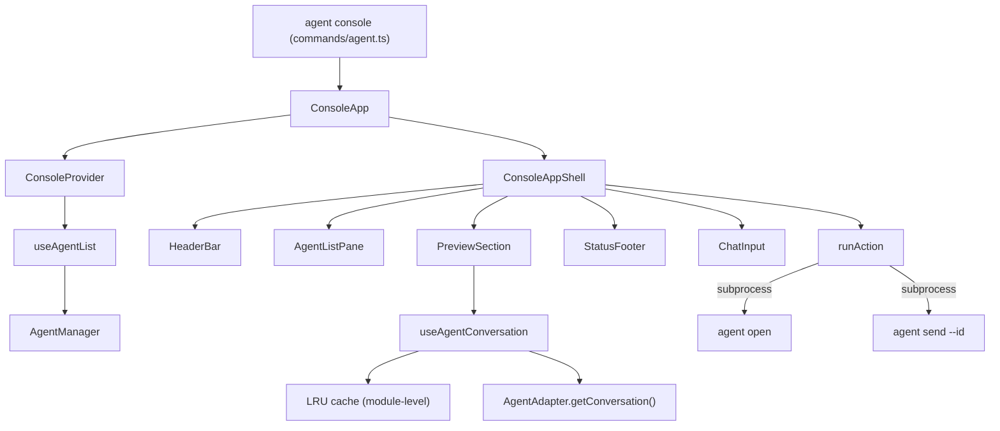

# System Design & Architecture

## Architecture Overview



**Key architectural decisions:**
- All keyboard handling (`useInput`) centralised in `ConsoleAppShell` (non-memo) — Ink 7 + React 19 silently drops `useInput` inside `React.memo` components
- Actions dispatch via `spawn()` re-invoking the CLI with `stdio: pipe` so the TUI never yields the terminal
- Context value stabilised with `useMemo` so quiet polls don't re-render all consumers

## Data Models

**AgentInfo** (from `@ai-devkit/agent-manager`)
```typescript
{ name, type, status, projectPath, summary, lastActive, sessionFilePath }
```

**ConversationMessage**
```typescript
{ role: 'user' | 'assistant' | 'system', content: string, timestamp?: string }
```

**ConsoleContextValue**
```typescript
{ agents, error, lastUpdated, isLoading, manager, inputFocused }
```

**CacheEntry** (module-level LRU, max 50)
```typescript
{ mtime: number, messages: ConversationMessage[] }
```

## Component Breakdown

| Component | File | Responsibility |
|-----------|------|----------------|
| `ConsoleApp` | `ConsoleApp.tsx` | Context provider wrapper |
| `ConsoleAppShell` | `ConsoleApp.tsx` | All state, keyboard handling, layout math |
| `HeaderBar` | `HeaderBar.tsx` | Agent count + app label |
| `AgentListPane` | `AgentListPane.tsx` | 2-line agent rows with status/name/type/summary |
| `PreviewSection` | `PreviewSection.tsx` | Runs `useAgentConversation`, wraps `PreviewPane` |
| `PreviewPane` | `PreviewPane.tsx` | Renders last N messages with role/timestamp |
| `StatusFooter` | `StatusFooter.tsx` | Status counts + updated time + keybinding hints |
| `ChatInput` | `ChatInput.tsx` | Controlled text input for sending messages |
| `FormatStatus` | `render/formatStatus.tsx` | Status glyph + label |
| `ConsoleProvider` | `state/ConsoleContext.tsx` | Provides agent list via context |
| `useAgentList` | `hooks/useAgentList.ts` | Polls `manager.listAgents()` every 3s |
| `useAgentConversation` | `hooks/useAgentConversation.ts` | Polls conversation with debounce + LRU cache |
| `useTerminalSize` | `hooks/useTerminalSize.ts` | Debounced terminal resize listener |
| `runAction` | `actions/runAction.ts` | Spawns CLI subprocess for open/send |
| `computeLayout` | `ConsoleApp.tsx` | Pure function: cols/rows → layout dimensions |

## Layout Design

```
┌─ ai-devkit · agent console   3 agents ──────────────────────────────┐
├──────────────────────┬─────────────────────────────────────────────┤
│ AGENTS (3)           │ PREVIEW · jarvis · claude · 2m ago · ~/code │
│ ● run  jarvis  claude│ user:                                        │
│   ~/projects/jarvis  │   can you fix the login bug?                 │
│ ─────────────────────│ assistant:                                   │
│ ◐ wait  titan  codex │   Sure, looking at auth.ts now…              │
│   ~/projects/titan   │─────────────────────────────────────────────│
│ ─────────────────────│ ╭─────────────────────────────────────────╮ │
│ ○ idle  scout  gemini│ │ > press i to type a message              │ │
│   ~/projects/scout   │ ╰─────────────────────────────────────────╯ │
├──────────────────────┴─────────────────────────────────────────────┤
│ 1 run · 1 wait · 1 idle  ·  updated 2s ago  ·  j/k · o · i · q   │
└────────────────────────────────────────────────────────────────────┘
```

- Narrow mode (< 120 cols): only left pane shown, preview hidden
- Left pane fixed at 48 cols; right column fills remaining space

## Design Decisions

| Decision | Choice | Rationale |
|----------|--------|-----------|
| Keyboard handler location | Single non-memo `ConsoleAppShell` | Ink 7 + React 19: `useInput` silently fails in `React.memo` |
| Action execution | Subprocess re-invoking CLI | TUI stays alive; no terminal handoff complexity |
| Conversation data | Sync `statSync` + JSONL parse | Session files are local; async adds race complexity without benefit |
| Cache | Module-level LRU Map (max 50) | Survives selection changes; evicts old entries; no library needed |
| Context stabilisation | `useMemo` on context value | Quiet polls (`setState` returns `prev`) don't re-render consumers |
| Poll interval | 3s for both list and conversation | Balances freshness vs CPU; paused during input focus |
| `inFlightRef` reset | At top of each effect run | Prevents blocked fetch after dependency change |

## Non-Functional Requirements

- Layout must not shift when selecting a different agent (all boxes use fixed widths + `flexShrink={0}`)
- Conversation cache must not grow unbounded (LRU eviction at 50 entries)
- Actions must not unmount the TUI (subprocess with `stdio: pipe`)
- Terminal resize must be debounced (80ms) to avoid render storms
