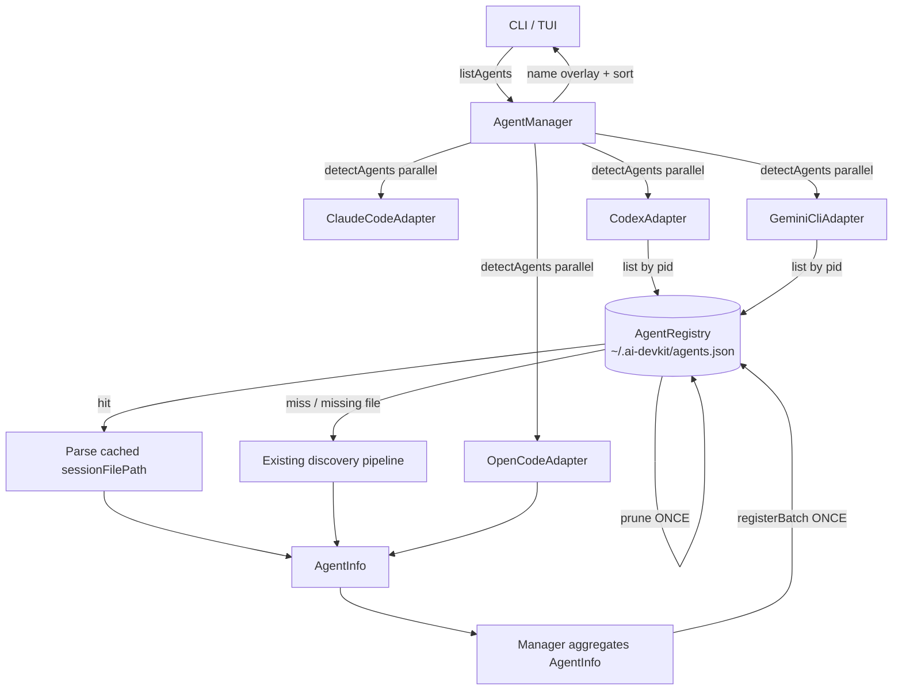

# System Design & Architecture

## Architecture Overview

`AgentRegistry` becomes the authoritative record of "what's running." `AgentManager.listAgents()` is the **single writer**: after every adapter detects in parallel, the manager batches all entries to disk and prunes dead pids. Adapters with expensive matching pipelines (Codex, Gemini) read the registry by pid and skip discovery on a hit. Claude and OpenCode already have O(1) authoritative lookups (PID file + SQLite) so they don't consult the cache.



### Adapter responsibilities

| Adapter | Reads registry | Writes registry | Notes |
|---|---|---|---|
| ClaudeCodeAdapter | no | no — manager writes | `~/.claude/sessions/<pid>.json` lookup is already O(1); no cache benefit |
| CodexAdapter | yes | no — manager writes | Hit path skips day-bucket walk |
| GeminiCliAdapter | yes | no — manager writes | Hit path skips chats-dir walk + per-file reads |
| OpenCodeAdapter | no | no — manager writes | SQLite already fast; entry written for contract |

**Single-writer invariant (within `listAgents`):** during a `listAgents` call, only the manager writes — adapters read only. External callers (e.g. `agent.service.startAgent`) may still call `register()` between `listAgents` calls; atomic `tmp + rename` keeps readers safe from torn writes.

## Data Models

### `RegistryEntry`

```ts
export interface RegistryEntry {
    name: string;
    type: AgentType;
    pid: number;
    tmuxSession: string;     // empty when auto-upserted
    cwd: string;
    startedAt: string;       // ISO 8601 — the time the registry first recorded this entry
    sessionId: string;
    sessionFilePath: string; // absolute path, empty string for OpenCode
}

interface RegistryFile {
    entries: RegistryEntry[];
}
```

No `processStartedAtMs`. No staleness check. Pid recycle within the same agent type + same cwd between two `listAgents()` calls is rare enough to defer.

### On-disk example

```jsonc
{
  "entries": [
    {
      "name": "ai-devkit-41203",
      "type": "claude",
      "pid": 41203,
      "tmuxSession": "",
      "cwd": "/Users/hoangnguyen/Codeaholicguy/Code/ai-devkit",
      "startedAt": "2026-05-30T09:14:22.000Z",
      "sessionId": "a7c4e2f1-9d3b-4e8a-b1c0-2f8e7d9a5c3b",
      "sessionFilePath": "/Users/hoangnguyen/.claude/projects/-Users-hoangnguyen-Codeaholicguy-Code-ai-devkit/a7c4e2f1-9d3b-4e8a-b1c0-2f8e7d9a5c3b.jsonl"
    }
  ]
}
```

### `AgentInfo`

Unchanged from current shape. No new fields needed — `AgentManager.toRegistryEntry` builds `RegistryEntry` directly from `AgentInfo` plus the prior `RegistryEntry` (for preserving `name` and `startedAt`).

## API Design

### `AgentRegistry`

```ts
class AgentRegistry {
    // existing
    register(entry: RegistryEntry): void;     // delegates to registerBatch([entry])
    lookup(name: string): RegistryEntry | null;
    list(): RegistryEntry[];
    prune(): void;
    isAlive(entry: RegistryEntry): boolean;

    // NEW
    registerBatch(entries: RegistryEntry[]): void;  // single read + single write
}
```

Adapter cache short-circuits build a `Map<pid, entry>` once from `list()` rather than calling a pid-keyed lookup per process.

### Upsert semantics (`register` / `registerBatch`)

For each incoming entry, upsert by `name`. All fields replace, except `tmuxSession`: keep existing non-empty value when incoming is empty.

`registerBatch` is the preferred path: one read, in-memory merge for all entries, one atomic write.

### Per-adapter pattern (Codex / Gemini)

```ts
async detectAgents(): Promise<AgentInfo[]> {
    const processes = enrichProcesses(listAgentProcesses(this.executable));
    const cached: Array<{ proc: ProcessInfo; entry: RegistryEntry }> = [];
    const uncached: ProcessInfo[] = [];
    const byPid = new Map(this.registry.list().map(e => [e.pid, e]));

    for (const proc of processes) {
        const entry = byPid.get(proc.pid);
        if (entry && entry.type === this.agentType && fs.existsSync(entry.sessionFilePath)) {
            cached.push({ proc, entry });
        } else {
            uncached.push(proc);
        }
    }

    const agents: AgentInfo[] = [];

    for (const { proc, entry } of cached) {
        const session = this.parser.readSession(entry.sessionFilePath, /*…*/);
        if (!session) { uncached.push(proc); continue; }
        agents.push(this.buildAgentInfoFromHit(proc, entry, session));
    }

    for (const proc of uncached) {
        const match = this.matchProcess(proc);
        agents.push(match ? this.buildAgentInfoFromMatch(proc, match) : this.processOnlyAgent(proc));
    }

    return agents;
}
```

`entry.type === this.agentType` guards against pid reuse across agent types between runs (cheap, no extra IO). Pid reuse within the same type is the accepted trade-off.

### `AgentManager.listAgents()` — single writer

```ts
async listAgents(options?): Promise<AgentInfo[]> {
    const allAgents = await this.runAdaptersInParallel();

    const existingByName = new Map(this.registry.list().map(e => [e.name, e]));
    const entries = allAgents.map(a => this.toRegistryEntry(a, existingByName.get(a.name)));
    if (entries.length > 0) this.registry.registerBatch(entries);
    this.registry.prune();

    return this.applyNameOverlayAndSort(allAgents, options);
}

private toRegistryEntry(agent: AgentInfo, existing?: RegistryEntry): RegistryEntry {
    return {
        name: existing?.name ?? agent.name,
        type: agent.type,
        pid: agent.pid,
        tmuxSession: existing?.tmuxSession ?? '',
        cwd: agent.projectPath,
        startedAt: existing?.startedAt ?? new Date().toISOString(),
        sessionId: agent.sessionId,
        sessionFilePath: agent.sessionFilePath ?? '',
    };
}
```

**Ordering:** `registerBatch` before `prune`. Fresh entries are written first; `prune` then removes any leftover entries whose pid is dead.

## Component Breakdown

| File | Change |
|---|---|
| `packages/agent-manager/src/utils/AgentRegistry.ts` | Add `sessionId` + `sessionFilePath` to `RegistryEntry`; add `registerBatch`; merge rule on upsert |
| `packages/agent-manager/src/AgentManager.ts` | Build `RegistryEntry[]` from `AgentInfo[]` via `toRegistryEntry`, `registerBatch` once, then `prune` |
| `packages/agent-manager/src/adapters/ClaudeCodeAdapter.ts` | No change (PID-file lookup already O(1)) |
| `packages/agent-manager/src/adapters/CodexAdapter.ts` | Optional `registry` ctor arg; pre-pipeline cache short-circuit via `registry.list()` Map |
| `packages/agent-manager/src/adapters/GeminiCliAdapter.ts` | Optional `registry` ctor arg; pre-pipeline cache short-circuit via `registry.list()` Map |
| `packages/agent-manager/src/adapters/OpenCodeAdapter.ts` | No change (manager handles write) |

## Design Decisions

### 1. Cache match only, not content

`summary`, `status`, `lastActive` are re-derived every call. Registry stores only the (pid → session) mapping plus identity fields.

### 2. Manager is the single writer during `listAgents`

Adapters run in parallel. Per-adapter `register()` calls during detection would race read-modify-write. Centralizing the write to the manager removes the race. Out-of-band writes from other flows (e.g. `agent start`) are allowed — they happen outside `listAgents` and are serialized at the OS level by atomic `tmp + rename`.

### 3. No `processStartedAtMs`, no staleness check

Compact intent: "the pid recycle is rare and we can skip for now." Type guard in adapter (`entry.type === this.agentType`) handles cross-type pid reuse; intra-type reuse is accepted.

### 4. Name-keyed registry

`generateAgentName(cwd, pid)` embeds pid → distinct pids produce distinct names → one entry per live pid follows.

### 5. Batched writes via `registerBatch`

One read, one atomic write per `listAgents()` call.

### 6. `tmuxSession` merge on upsert

Adapter auto-upsert passes empty string. Preserve any non-empty value already on disk (set by future tmux integration or explicit user `register()`).

### 7. OpenCode and Claude in the registry, no short-circuit

Both already have O(1) authoritative lookups (Claude PID file, OpenCode SQLite). Entries still written by manager to keep the contract uniform.

## Non-Functional Requirements

### Performance

| Adapter | Hit-path savings (est.) |
|---|---|
| Claude | n/a (no short-circuit; PID-file already O(1)) |
| Codex | 20–100ms (skip day-bucket walk) |
| Gemini | 50–300ms (skip chats-dir walk + per-file reads) |
| OpenCode | n/a |

Added per call: 1 atomic write + 1 `prune` sweep.

### Reliability

- Atomic `tmp + rename` writes.
- `existsSync` guard at hit-path call site forces fall-through if the session file was deleted.
- `prune()` keeps the file bounded by live processes.

### Testability

- `AgentRegistry` accepts a file path in the constructor — tests use tmp files.
- Adapters accept a `registry` constructor arg (default `AgentRegistry.default()`).
