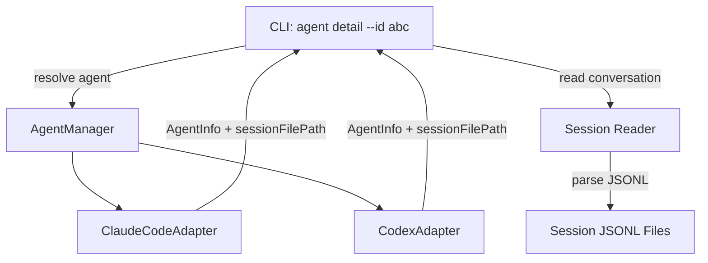

# System Design & Architecture

## Architecture Overview

The `agent detail` command follows the existing adapter pattern. It reuses `AgentManager` for agent discovery and resolution, then adds a conversation-reading layer.



**Key insight:** The existing adapters already read session files to extract status/summary. For `detail`, we need the full conversation, which requires a second pass that reads and parses all JSONL entries (not just the last few lines).

## Data Models

### AgentDetail (extends AgentInfo conceptually)

```typescript
interface AgentDetail {
    sessionId: string;
    cwd: string;
    startTime: Date;
    status: AgentStatus;
    type: AgentType;
    name: string;
    slug?: string;
    conversation: ConversationMessage[];
}

interface ConversationMessage {
    role: 'user' | 'assistant' | 'system';
    content: string;
    timestamp?: string;
}
```

### Conversation parsing rules

**Claude Code JSONL:**
- Each line is `{ type, timestamp, message, ... }`
- `type: "user"` → role=user, extract text from `message.content`
- `type: "assistant"` → role=assistant, extract text from `message.content`
- `type: "system"` → role=system
- Skip metadata types: `file-history-snapshot`, `last-prompt`, `progress`, `thinking`
- **Default mode:** Extract only text blocks from `message.content` arrays
- **Verbose mode:** Also include tool_use blocks (name + input summary) and tool_result blocks

**Codex JSONL:**
- First line: `session_meta` → skip (metadata only)
- Subsequent lines have `type`, `timestamp`, and `payload` with `payload.message` (plain string) and `payload.type`
- Map `payload.type` to roles: `user_message` → user, `agent_message` → assistant, others → system
- Default mode: extract `payload.message` strings
- Verbose mode: include additional payload details if present

## API Design

### CLI Interface

```
ai-devkit agent detail --id <name> [--json] [--full] [--tail <n>] [--verbose]
```

**Options:**
- `--id <name>` (required): Agent name (as shown in `agent list` output)
- `--json` (optional): Output as JSON
- `--full` (optional): Show entire conversation history (default: last 20 messages)
- `--tail <n>` (optional): Show last N messages (default: 20)
- `--verbose` (optional): Include tool call/result details in messages

**Default output format (human-readable, text only, last 20 messages):**
```
Agent Detail
────────────────────────────────
  Session ID:  a6ce7023-6ac4-40b7-a8a5-dde50645bed5
  CWD:         ~/Code/ai-devkit
  Start Time:  2026-03-27 10:30:00
  Status:      🟢 run
  Type:        Claude Code

Conversation (last 20 messages)
────────────────────────────────
[10:30:05] user:
  Fix the login bug in auth.ts

[10:30:12] assistant:
  I'll look at the auth.ts file...
  ...
```

**Verbose mode adds tool details:**
```
[10:30:12] assistant:
  I'll look at the auth.ts file...
  [Tool: Read] auth.ts
  [Tool: Edit] auth.ts (lines 15-20)
```

### Internal API

Add `getConversation()` as a **required** method on the `AgentAdapter` interface:

```typescript
interface AgentAdapter {
    // existing...
    getConversation(sessionFilePath: string, options?: { verbose?: boolean }): ConversationMessage[];
}
```

Each adapter implements its own parsing logic (Claude: structured content blocks, Codex: `payload.message` strings) but all return the same `ConversationMessage[]` output.

## Component Breakdown

1. **CLI command handler** (`packages/cli/src/commands/agent.ts`):
   - New `detail` subcommand under the existing `agent` command
   - Uses `AgentManager` to list + resolve agent
   - Calls conversation reader
   - Formats and displays output

2. **Conversation reader** (`packages/agent-manager/src/`):
   - New method or utility to parse full conversation from JSONL
   - Claude-specific parsing in `ClaudeCodeAdapter`
   - Codex-specific parsing in `CodexAdapter`
   - Returns `ConversationMessage[]`

3. **AgentInfo extension**:
   - Add `sessionFilePath?: string` to `AgentInfo` — already known at detection time, avoids re-discovery

## Design Decisions

| Decision | Choice | Rationale |
|----------|--------|-----------|
| Where to add conversation parsing | Required method on `AgentAdapter` interface | Each adapter has its own JSONL format but unified output |
| How to pass session file path | Add to `AgentInfo` | Already known at detection, avoids re-discovery |
| Output format | Table header + message list | Consistent with `agent list` style |
| Message filtering | Skip progress/thinking/metadata | Show only meaningful conversation turns |
| Default message count | Last 20 | Practical default; `--full`/`--tail` for overrides |
| Tool display | Text-only default, `--verbose` for tools | Keeps output clean; tools are verbose |
| Identifier type | Name only | Consistent, simple; users copy from `agent list` |
| Non-running agents | Not supported | Scoped to running processes only |

## Non-Functional Requirements

- **Performance:** Session files can be large. Read the file once, parse line-by-line. No concern for very large files since we're already reading them in `readSession()`.
- **Reliability:** Graceful handling of corrupted JSONL lines (skip and continue).
- **Compatibility:** Works on macOS and Linux (same as existing commands).
