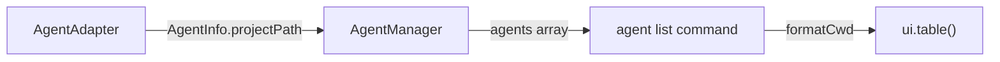

# Display CWD in Agent List — Design

## Architecture Overview

No new components are needed. This feature modifies the existing CLI table rendering in the `agent list` command.

## Data Models

No changes to `AgentInfo`. The existing `projectPath: string` field is used as-is.

## Component Changes

### `packages/cli/src/commands/agent.ts`

1. **New helper function** — `formatCwd(projectPath: string): string`
   - Replaces home directory prefix with `~` using `os.homedir()`
   - Returns the shortened path or the original if no substitution applies
   - Returns empty string for empty/undefined input

2. **Table modification** — Add "CWD" column:
   - **Position**: Column index 1 (after "Agent", before "Type")
   - **Data**: `formatCwd(agent.projectPath)`
   - **Style**: `chalk.dim` for subdued visual weight

### Updated table structure

| Agent | CWD | Type | Status | Working On | Active |
|-------|-----|------|--------|------------|--------|
| my-project | ~/Code/my-project | Claude Code | 🟢 run | Investigating... | 5m ago |

## Design Decisions

| Decision | Choice | Rationale |
|----------|--------|-----------|
| Path format | `~` substitution | Compact, familiar to CLI users |
| Column position | After Agent | CWD is a project identifier, logically grouped with name |
| Column style | `chalk.dim` | Secondary info, shouldn't dominate the table |

## Non-Functional Requirements

- No performance impact — `os.homedir()` is a synchronous, cached call
- No new dependencies required
