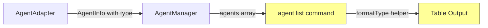

# Design: Agent List Type Column

## Architecture Overview

This is a presentation-layer change only. No data model or adapter changes needed.

Yellow highlights indicate changed components.

## Data Models

No changes. `AgentInfo.type` (`AgentType = 'claude' | 'gemini_cli' | 'codex' | 'other'`) is already available.

## Component Changes

### `packages/cli/src/commands/agent.ts`

1. **Add `formatType()` helper** — maps `AgentType` to human-friendly label:
   | AgentType | Display Label |
   |-----------|--------------|
   | `claude` | Claude Code |
   | `codex` | Codex |
   | `gemini_cli` | Gemini CLI |
   | `other` | Other |

2. **Update table headers** — insert "Type" as the 2nd column:
   `['Agent', 'Type', 'Status', 'Working On', 'Active']`

3. **Update row mapping** — insert `formatType(agent.type)` as the 2nd value.

4. **Update column styles** — insert a style function for the Type column (dim or standard color).

## Design Decisions

- **Human-friendly labels**: Users shouldn't need to know internal enum values.
- **2nd column placement**: Type is a primary identifier, logically grouped with agent name.
- **No data layer changes**: The type field already exists and is populated correctly.

## Non-Functional Requirements

- No performance impact — simple string mapping on already-loaded data.
