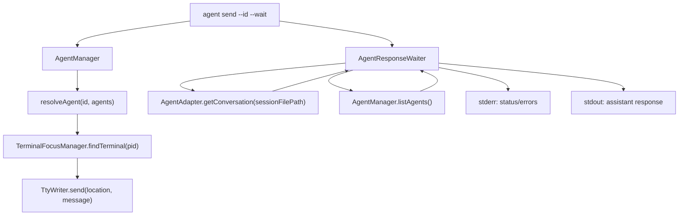

# Agent Send Wait Design

## Architecture Overview



The command flow is:

1. Resolve the target agent using the existing `--id` logic.
2. Parse and validate `--timeout <milliseconds>` when provided with `--wait`.
3. Find the terminal and validate `sessionFilePath` when `--wait` is enabled.
4. Seed the transcript cursor from the current conversation length before sending.
5. Send the message with `TtyWriter.send()`.
6. Poll the conversation for new messages and print assistant text content that appears after the seed cursor.
7. Poll agent status until the original target returns to `waiting`, disappears, or the configured wait cap is reached.

## Data Models

No persistent data model is required.

Internal wait result:

```typescript
interface AgentSendWaitResult {
  agentName: string;
  agentType: AgentType;
  pid: number;
  sessionId: string;
  sessionFilePath: string;
  messages: ConversationMessage[];
  finalStatus: AgentStatus;
  elapsedMs: number;
}
```

Internal wait options:

```typescript
interface AgentSendWaitOptions {
  pollIntervalMs: number;
  maxWaitMs: number;
  timeoutLabel?: string;
}
```

`maxWaitMs` defaults to 10 minutes and is overridden by `--timeout <milliseconds>` when provided. `timeoutLabel` preserves the user-facing millisecond value for clear timeout errors.

## API Design

CLI interface:

```bash
npx ai-devkit agent send <message> --id <identifier> --wait
npx ai-devkit agent send <message> --id <identifier> --wait --timeout 30000
```

Behavior:

- `--wait` is optional and defaults to `false`.
- `--timeout <milliseconds>` is optional and only valid with `--wait`.
- Timeout values are positive integers interpreted as milliseconds.
- Without `--wait`, the command keeps the current fire-and-forget path.
- With `--wait`, stdout is reserved for assistant response text.
- With `--wait`, status/progress/warnings/errors must go to stderr. Current `ui.info`, `ui.warning`, and `ui.success` write to stdout, so the wait path should use a small stderr writer or direct `process.stderr.write()` for non-response messages.
- With `--wait`, do not print the existing success line (`Sent message to ...`) to stdout after delivery.

Internal helper:

```typescript
async function waitForAgentResponse(params: {
  manager: AgentManager;
  adapter: AgentAdapter;
  target: {
    id: string;
    name: string;
    type: AgentType;
    pid: number;
    sessionId: string;
    sessionFilePath: string;
  };
  initialMessageCount: number;
  options: AgentSendWaitOptions;
  onAssistantMessage: (message: ConversationMessage) => void;
  onStatus?: (message: string) => void;
}): Promise<AgentSendWaitResult>;
```

`target.id` is the original `--id` value for user-facing context, but the wait loop should prefer `pid` and `sessionId` when finding the same running agent on later polls. This avoids accidentally switching to a different process if a partial name becomes ambiguous while waiting.

## Component Breakdown

### CLI command

File: `packages/cli/src/commands/agent.ts`

- Add `.option('--wait', 'Wait for and print the agent response')`.
- Add `.option('--timeout <milliseconds>', 'Maximum time to wait with --wait, in milliseconds')`.
- Validate that `--timeout` is only used with `--wait`.
- Parse valid timeout milliseconds before sending.
- Before sending, validate `agent.sessionFilePath` when `options.wait` is true.
- Find the owning adapter with existing `manager.getAdapter(agent.type)`.
- Seed `initialMessageCount` from `adapter.getConversation(agent.sessionFilePath, { verbose: false }).length`.
- Send via `TtyWriter.send()`.
- If `--wait`, call the wait helper and print assistant messages as complete transcript messages are detected.
- If `--wait`, use stderr for pre-send warnings and wait status messages so stdout remains response-only.

### Wait helper

Preferred location: `packages/cli/src/services/agent/agent.service.ts`

Responsibilities:

- Poll conversation and status.
- Track already emitted transcript indexes.
- Emit only messages where `role === 'assistant'` and `content` is non-empty.
- Stop when the resolved target returns to `AgentStatus.WAITING`.
- Also stop on `AgentStatus.IDLE` after at least one new assistant message has been emitted for this send; Claude Code can move from busy to idle after writing the response instead of reporting waiting.
- Do not stop on `AgentStatus.WAITING` until a transcript read succeeds for the current loop; this avoids missing a final response when the transcript is observed mid-write.
- Fail if the target disappears.
- Fail if the configured safety cap is reached.
- Use `timeoutLabel` in timeout errors when available so users see the millisecond timeout they entered.
- Write a no-response status note to stderr if the target returns to waiting without new assistant text.
- Return structured result for tests and future JSON output.

### Tests

Primary test file: `packages/cli/src/__tests__/commands/agent.test.ts`

Add focused service tests if the wait helper is extracted.

## Design Decisions

| Decision | Choice | Rationale |
|---|---|---|
| Response source | Transcript via `getConversation()` | Existing adapter contract already normalizes Claude, Codex, and Gemini transcripts. |
| Completion signal | Agent returns to `waiting` | Matches existing agent status model and user expectation that the turn is done when input is accepted again. |
| Transcript cursor | Seed by current conversation length before send | Prevents historical messages from being printed. |
| Output default | Assistant text content only on stdout | Keeps the command useful in scripts and close to `claude -p` ergonomics. |
| Status output | stderr for wait mode | Existing `ui.info`, `ui.warning`, and `ui.success` write to stdout, so wait mode needs a response-safe status path. |
| Polling | Interval polling | Existing channel bridge already uses polling; no new daemon or file watcher is needed. |
| Target tracking | Prefer original PID and session ID | Avoids changing targets if a partial name resolves differently during the wait. |
| Safety cap | Default 10 minutes, configurable with `--timeout` | Prevents indefinite hangs while letting scripts choose an appropriate failure window. |
| Scope | `--wait` plus timeout | Keeps the command scriptable while leaving stdin wrappers and `agent ask` for later backlog items. |

Alternatives considered:

- **Block on terminal output:** rejected because terminal screen capture is brittle and terminal-specific.
- **Use Claude Agent SDK / `claude -p`:** rejected because the feature goal is to use interactive Claude Code sessions.
- **Add `agent ask` first:** rejected because `agent ask` should be a wrapper once `agent send --wait` is reliable.

## Non-Functional Requirements

- Polling must avoid tight loops; use an interval around 1-2 seconds.
- The command must not mutate transcript files.
- The command must not introduce shell interpolation. Message delivery remains handled by `TtyWriter`.
- The command must exit non-zero for delivery failure, missing transcript support, target termination, or safety-cap timeout.
- The command must keep stdout response-only in wait mode.
- Implementation should keep response waiting testable without real terminals or real Claude Code sessions.
