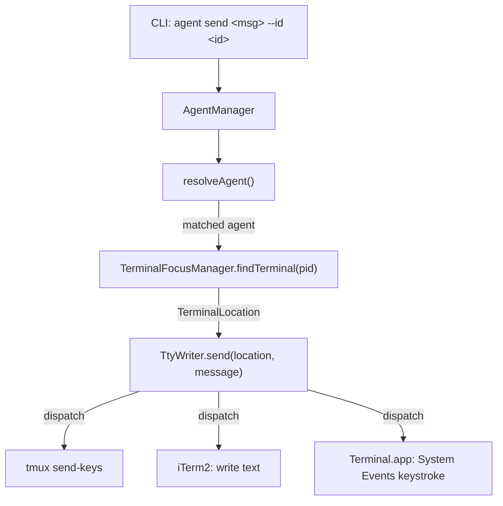

# Agent Send Command - Design

## Architecture Overview



The flow is:
1. CLI parses `--id` flag and message argument
2. `AgentManager.listAgents()` detects all running agents
3. `AgentManager.resolveAgent(id, agents)` finds the target
4. If agent status is not `waiting`, print a warning but continue
5. `TerminalFocusManager.findTerminal(pid)` identifies the terminal emulator and session
6. `TtyWriter.send(location, message)` dispatches to the correct send mechanism

## Data Models

No new data models needed. Reuses existing:
- `AgentInfo` (from `AgentAdapter.ts`) - contains `pid`, `name`, `slug`, `status`
- `TerminalLocation` (from `TerminalFocusManager.ts`) - contains `type`, `identifier`, `tty`

## API Design

### CLI Interface

```
ai-devkit agent send <message> --id <identifier>
```

- `<message>`: Required positional argument. The text to send.
- `--id <identifier>`: Required flag. Agent name, slug, or partial match string.

### Module: TtyWriter

Location: `packages/agent-manager/src/terminal/TtyWriter.ts`

```typescript
export class TtyWriter {
  /**
   * Send a message as keyboard input to a terminal session.
   * Dispatches to the correct mechanism based on terminal type.
   *
   * @param location - Terminal location from TerminalFocusManager.findTerminal()
   * @param message - Text to send
   * @throws Error if terminal type is unsupported or send fails
   */
  static async send(location: TerminalLocation, message: string): Promise<void>;
}
```

### Per-terminal mechanisms

| Terminal | Method | How Enter is sent |
|----------|--------|-------------------|
| tmux | `tmux send-keys -t <pane> "msg" Enter` | tmux `Enter` key literal |
| iTerm2 | AppleScript `write text "msg"` | `write text` auto-appends newline |
| Terminal.app | System Events `keystroke "msg"` + `key code 36` | `key code 36` = Return key |

## Component Breakdown

### 1. TtyWriter (new) - `agent-manager` package
- Single static method `send(location, message)`
- Dispatches to `sendViaTmux`, `sendViaITerm2`, or `sendViaTerminalApp`
- tmux: uses `execFile('tmux', ['send-keys', ...])` — no shell
- iTerm2: uses `execFile('osascript', ['-e', script])` — no shell
- Terminal.app: uses `execFile('osascript', ['-e', script])` with System Events `keystroke` + `key code 36` — no shell
- Throws descriptive error for unsupported terminal types (`UNKNOWN`)

### 2. CLI `agent send` subcommand (new) - `cli` package
- Registers under existing `agentCommand`
- Parses `<message>` positional arg and `--id` required option
- Uses `AgentManager` to list and resolve agent
- Warns if agent status is not `waiting` (but still proceeds)
- Uses `TerminalFocusManager.findTerminal(pid)` to identify terminal
- Uses `TtyWriter.send(location, message)` to deliver message
- Displays success/error feedback via `ui`

### 3. Export from agent-manager (update)
- Export `TtyWriter` from `packages/agent-manager/src/terminal/index.ts`
- Export from `packages/agent-manager/src/index.ts`

## Design Decisions

| Decision | Choice | Rationale |
|----------|--------|-----------|
| Delivery mechanism | Terminal-native input injection | Writing to `/dev/ttysXXX` only outputs to terminal display, doesn't inject input. Must go through the terminal emulator. |
| Agent identification | `--id` flag only | Explicit, avoids confusion with positional args |
| tmux send | `tmux send-keys` + `Enter` | Standard tmux API for injecting keystrokes into a pane |
| iTerm2 send | AppleScript `write text` | Writes to session as typed input, auto-appends newline |
| Terminal.app send | System Events `keystroke` + `key code 36` | `do script` runs a new shell command (wrong). `keystroke` types into the foreground process and `key code 36` sends Return. |
| Shell safety | `execFile` for all subprocess calls | `execFile` bypasses the shell entirely, preventing command injection from message content (e.g., single quotes, backticks). |
| AppleScript escaping | Escape `\` and `"` for double-quoted strings | Prevents AppleScript string breakout. Combined with `execFile`, no shell escaping needed. |
| Embedded newlines | Send as-is | Each emulator handles the message as a single input. No splitting. |
| Module location | `TtyWriter` in agent-manager | Reusable by other features; keeps terminal logic together with `TerminalFocusManager` |

## Non-Functional Requirements

- **Performance**: All mechanisms are near-instant (exec a single command)
- **Security**: All subprocesses use `execFile` (no shell). AppleScript strings are escaped for `\` and `"`. No command injection vector.
- **Reliability**: Terminal type is detected first; unsupported types fail with clear error. Each emulator method validates session was found.
- **Portability**: Works on macOS (tmux, iTerm2, Terminal.app). Linux supported via tmux. Other Linux terminals are unsupported (returns `UNKNOWN`).

## Known Limitations

- **`UNKNOWN` terminal type**: If the agent runs in a terminal we can't identify (Warp, VS Code terminal, Alacritty without tmux), `send` fails. Users must use tmux in these cases.
- **Terminal.app `keystroke`**: Requires Terminal.app to be brought to foreground (the script activates it). This briefly steals focus.
- **iTerm2 `write text`**: Auto-appends a newline. Messages with embedded newlines will submit multiple lines.
