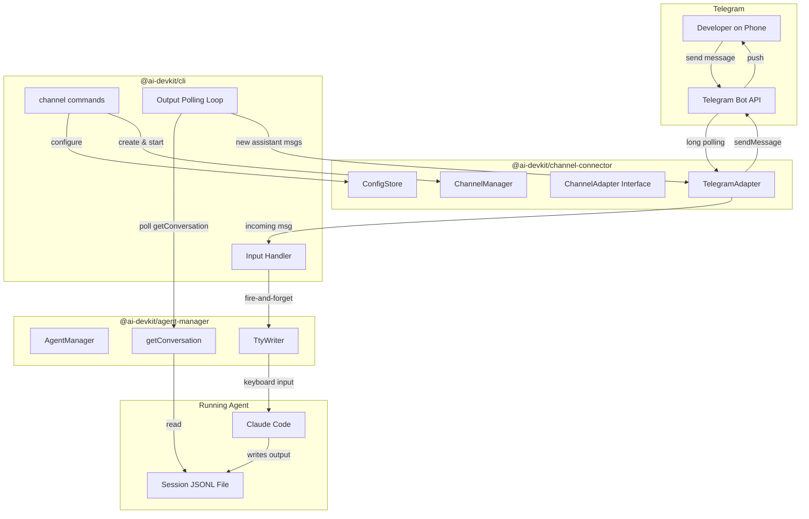

# System Design: Channel Connector

## Architecture Overview

The key architectural principle: **channel-connector is a pure message pipe**. It knows nothing about agents. CLI is the orchestrator that connects channel-connector with agent-manager.



### Key Separation of Concerns

| Layer | Package | Responsibility |
|-------|---------|---------------|
| **Channel** | `channel-connector` | Connect to messaging platforms, receive/send text. No agent knowledge. |
| **Orchestration** | `cli` | Wire channel-connector to agent-manager. Provide message handler. |
| **Agent** | `agent-manager` | Detect agents, send input (TtyWriter), read conversation history. |

### Key Components (channel-connector only)

| Component | Responsibility |
|-----------|---------------|
| `ChannelManager` | Registers adapters, manages lifecycle, routes messages to/from handler callback |
| `ChannelAdapter` | Interface for messaging platforms (Telegram, future: Slack, WhatsApp) |
| `TelegramAdapter` | Telegram Bot API integration via long polling |
| `ConfigStore` | Persists channel configurations (tokens, chat IDs, preferences) |

### Technology Choices
- **Telegram library**: `telegraf` (mature, TypeScript-native, active maintenance)
- **Config storage**: JSON file at `~/.ai-devkit/channels.json`
- **Process model**: Foreground process via `ai-devkit channel start`

## Data Models

### ChannelConfig
```typescript
interface ChannelConfig {
  channels: Record<string, ChannelEntry>;
}

interface ChannelEntry {
  type: 'telegram' | 'slack' | 'whatsapp';
  enabled: boolean;
  createdAt: string;
  config: TelegramConfig; // extend with union for future channel types
}

interface TelegramConfig {
  botToken: string;
  botUsername: string;
  authorizedChatId?: number; // auto-set from first user to message the bot
}
```

### Message Types (generic, no agent concepts)
```typescript
interface IncomingMessage {
  channelType: string;
  chatId: string;
  userId: string;
  text: string;
  timestamp: Date;
  metadata?: Record<string, unknown>;
}

/** Handler function provided by the consumer (CLI). Fire-and-forget — returns void. */
type MessageHandler = (message: IncomingMessage) => Promise<void>;
```

### Authorization Model
- First user to message the bot is auto-authorized: their `chatId` is stored in config via `ConfigStore`
- Subsequent messages from other chat IDs are rejected
- CLI tracks the authorized `chatId` in-memory for the output polling loop (captured from first incoming message)

## API Design

### ChannelAdapter Interface
```typescript
interface ChannelAdapter {
  readonly type: string;

  /** Start listening for messages */
  start(): Promise<void>;

  /** Stop listening */
  stop(): Promise<void>;

  /** Send a message to a specific chat. Automatically chunks messages exceeding platform limits (e.g., 4096 chars for Telegram), splitting at newline boundaries. */
  sendMessage(chatId: string, text: string): Promise<void>;

  /** Register handler for incoming text messages (fire-and-forget, responses sent via sendMessage) */
  onMessage(handler: (msg: IncomingMessage) => Promise<void>): void;

  /** Check if adapter is connected and healthy */
  isHealthy(): Promise<boolean>;
}
```

### ChannelManager API
```typescript
class ChannelManager {
  registerAdapter(adapter: ChannelAdapter): void;
  getAdapter(type: string): ChannelAdapter | undefined;
  startAll(): Promise<void>;
  stopAll(): Promise<void>;
}
```

### ConfigStore API
```typescript
class ConfigStore {
  constructor(configPath?: string); // defaults to ~/.ai-devkit/channels.json

  getConfig(): Promise<ChannelConfig>;
  saveChannel(name: string, entry: ChannelEntry): Promise<void>;
  removeChannel(name: string): Promise<void>;
  getChannel(name: string): Promise<ChannelEntry | undefined>;
}
```

### CLI Integration Pattern
```typescript
// In CLI's `channel start --agent <name>` command
import { ChannelManager, TelegramAdapter, ConfigStore } from '@ai-devkit/channel-connector';
import { AgentManager, ClaudeCodeAdapter, CodexAdapter, TtyWriter } from '@ai-devkit/agent-manager';

// 1. Set up agent-manager and resolve target agent by name
const agentManager = new AgentManager();
agentManager.registerAdapter(new ClaudeCodeAdapter());
agentManager.registerAdapter(new CodexAdapter());
const agents = await agentManager.listAgents();
const agent = agents.find(a => a.name === targetAgentName);

// 2. Set up channel-connector
const config = await configStore.getChannel('telegram');
const telegram = new TelegramAdapter({ botToken: config.botToken });

// 3. Track chatId from first incoming message
let activeChatId: string | null = null;

// 4. Register message handler (fire-and-forget to agent, capture chatId)
telegram.onMessage(async (msg) => {
  if (!activeChatId) {
    activeChatId = msg.chatId; // auto-authorize first user
  }
  if (msg.chatId !== activeChatId) return; // reject unauthorized
  await ttyWriter.write(agent.pid, msg.text); // send to agent, don't wait
});

// 5. Start agent output observation loop (polls and pushes to Telegram)
let lastMessageCount = 0;
const pollInterval = setInterval(() => {
  if (!activeChatId) return; // no user connected yet
  const conversation = agentAdapter.getConversation(agent.sessionFilePath);
  const newMessages = conversation.slice(lastMessageCount)
    .filter(m => m.role === 'assistant');
  for (const msg of newMessages) {
    telegram.sendMessage(activeChatId, msg.content); // auto-chunks at 4096 chars
  }
  lastMessageCount = conversation.length;
}, 2000);

// 5. Start channel
const manager = new ChannelManager();
manager.registerAdapter(telegram);
await manager.startAll();
```

### CLI Commands
```
ai-devkit channel connect telegram          # Interactive setup (bot token prompt)
ai-devkit channel list                      # Show configured channels
ai-devkit channel disconnect telegram       # Remove channel config
ai-devkit channel start --agent <agent-name> # Start bridge to specific agent
ai-devkit channel stop                      # Stop running bridge
ai-devkit channel status                    # Show bridge process status
```

## Component Breakdown

### Package: `@ai-devkit/channel-connector`
```
packages/channel-connector/
  src/
    index.ts                    # Public exports
    ChannelManager.ts           # Adapter registry and lifecycle
    ConfigStore.ts              # Config persistence (~/.ai-devkit/)
    adapters/
      ChannelAdapter.ts         # Interface definition
      TelegramAdapter.ts        # Telegram Bot API implementation
    types.ts                    # Shared type definitions
  __tests__/
    ChannelManager.test.ts
    ConfigStore.test.ts
    adapters/
      TelegramAdapter.test.ts
  package.json
  tsconfig.json
  tsconfig.build.json
  jest.config.ts
```

### CLI Integration (in `@ai-devkit/cli`)
```
packages/cli/src/commands/
  channel.ts                    # channel connect/list/disconnect/start/stop/status
```

## Design Decisions

### 1. Channel-connector has zero agent knowledge
**Decision**: No dependency on agent-manager. The package is a pure messaging bridge.
**Why**: Clean separation of concerns. Channel-connector can be used independently of agents (e.g., for notifications, other integrations). CLI is the natural integration point since it already depends on both packages.

### 2. Async fire-and-forget message handling
**Decision**: Consumer registers a `MessageHandler` callback that returns `void`. Responses are sent separately via `sendMessage()`.
**Why**: Agent responses are inherently async (can take seconds to minutes). Decoupling input and output avoids blocking. CLI runs a separate polling loop that observes agent conversation via `getConversation()` and pushes new assistant messages to the channel. This also naturally handles unsolicited agent output (errors, completions).

### 3. One agent per session (v1)
**Decision**: `channel start --agent <id>` binds one channel to one agent.
**Why**: Simplest mental model. No agent-routing logic needed in channel-connector. Developer explicitly chooses which agent to bridge. Can evolve to multi-agent in CLI later without changing channel-connector.

### 4. Adapter pattern (consistent with agent-manager)
**Decision**: Use pluggable adapter interface for channel implementations.
**Why**: Proven pattern in this codebase. Makes adding Slack/WhatsApp straightforward.

### 5. Long polling for Telegram (not webhooks)
**Decision**: Use Telegram's long polling via telegraf.
**Why**: No need for a public server/URL. Works behind firewalls and NAT. Simpler for CLI tool users.

### 6. Single config file at `~/.ai-devkit/`
**Decision**: Store channel configs globally, not per-project.
**Why**: A Telegram bot bridges to agents across projects. Global config avoids re-setup per project.

## Non-Functional Requirements

### Performance
- Message delivery latency: < 3 seconds (Telegram → handler → Telegram)
- Memory footprint: < 50MB for the bridge process

### Reliability
- Auto-reconnect on network failure with exponential backoff
- Graceful shutdown on SIGINT/SIGTERM
- Message queue for offline/reconnecting scenarios (in-memory, bounded)

### Security
- Bot token stored with file permissions 0600
- Only authorized chat IDs can interact with the bot
- No sensitive data logged or exposed in error messages
- Token validation on connect before persisting

### Scalability
- v1 targets single-user, single-machine use
- Adapter interface supports future multi-channel, multi-user scenarios
- Handler pattern allows CLI to evolve routing without channel-connector changes
