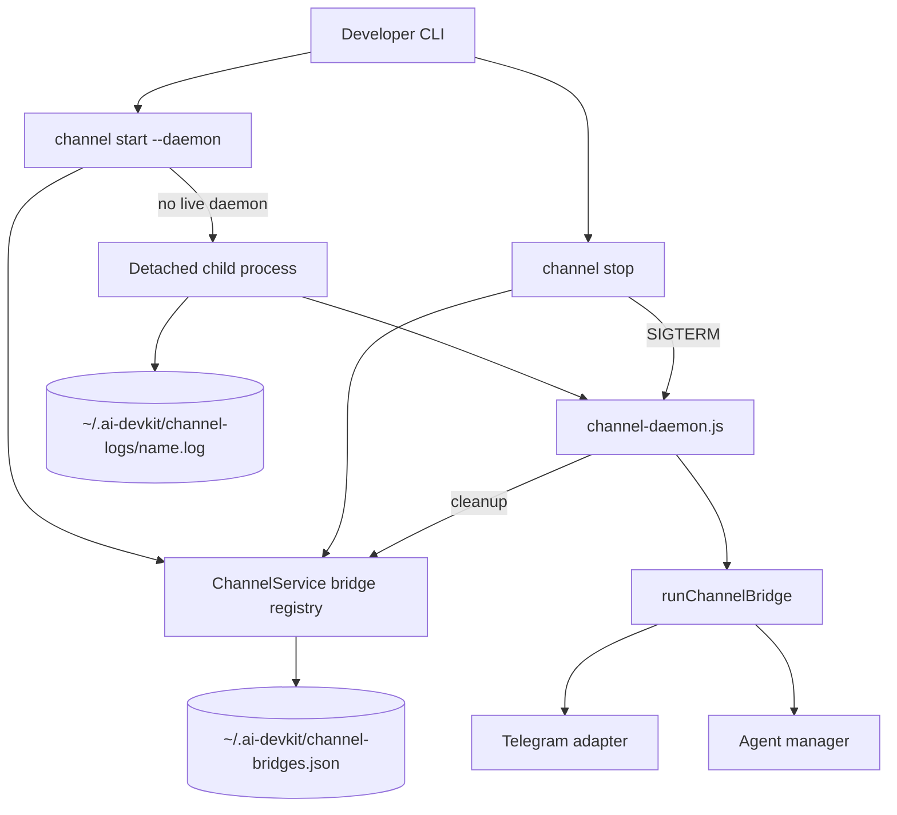

# System Design: Channel Daemon Mode

## Architecture Overview

`channel start --daemon` is implemented as a CLI process wrapper around an internal bridge runner. The parent CLI validates arguments, checks bridge state, spawns a detached child process, records metadata in the existing bridge registry, and exits. The child runs `channel-daemon.js`, which calls `runChannelBridge()` directly instead of re-entering Commander. Daemon stdout and stderr are appended to a per-channel log file and the parent prints that path after startup.



## Data Models

### ChannelBridgeProcess
```typescript
interface ChannelBridgeProcess {
  channelName: string;
  channelType: string;
  agentName: string;
  agentPid: number;
  bridgePid: number;
  startedAt: string;
  logPath?: string;
}
```

State is stored in the existing `~/.ai-devkit/channel-bridges.json` registry with restrictive permissions when possible. Daemon parent processes initially record `agentPid: 0`; `runChannelBridge()` overwrites the entry with the resolved agent PID after it finishes startup. Daemon logs are stored separately at `~/.ai-devkit/channel-logs/<channel>.log`.

## API Design

### CLI
```text
ai-devkit channel start [name] --agent <name> --daemon
ai-devkit channel stop
```

### Internal Service
```typescript
class ChannelService {
  getLiveBridges(): Promise<ChannelBridgeProcess[]>;
  startDaemonBridge(input: StartDaemonBridgeInput): Promise<ChannelBridgeProcess>;
  stopBridge(channelName?: string): Promise<StopBridgeResult>;
  unregisterBridge(channelName: string): Promise<void>;
}
```

The service owns process spawning, PID liveness checks, stale state cleanup, and stop signaling.

## Component Breakdown

- `packages/cli/src/services/channel/channel.service.ts`: bridge registry, daemon spawn, and stop lifecycle.
- `packages/cli/src/services/channel/channel-runner.ts`: reusable foreground bridge runtime.
- `packages/cli/src/channel-daemon.ts`: internal daemon child entrypoint.
- `packages/cli/src/commands/channel.ts`: adds the `--daemon` start option and `stop` subcommand.
- Existing channel bridge code remains the foreground execution path.

## Design Decisions

### Recommended Approach: Detached Child Process
Spawn a detached Node process that runs a dedicated internal daemon entrypoint. The daemon entrypoint calls the same `runChannelBridge()` function used by foreground start. This keeps bridge logic in one place, avoids hidden public CLI flags, and avoids OS-specific service management.

### Alternatives Considered
- **External process manager**: PM2/systemd/launchd would provide mature daemon features, but would add setup burden and platform-specific instructions.
- **Always background by default**: Simpler lifecycle for long-running bridges, but it would break existing users who expect foreground logs and Ctrl-C behavior.
- **Multiple daemon registry**: More flexible, but unnecessary for the current single-user Telegram bridge and increases stop/status complexity.

## Non-Functional Requirements

- Daemon start should return quickly after spawning and recording state.
- Daemon start and status should print the log path so users can inspect background failures.
- Stop should prefer graceful shutdown with `SIGTERM`.
- Stale state should not block future daemon starts.
- Foreground behavior must remain backward compatible.
- Bridge metadata must not include bot tokens or other secrets.
