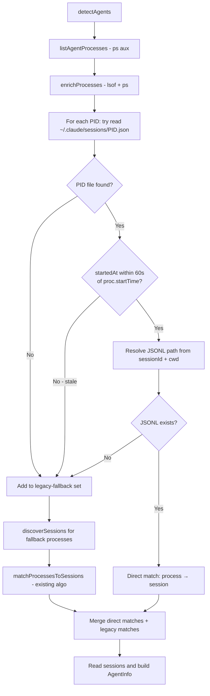

# System Design & Architecture

## Architecture Overview

The change is localised to `ClaudeCodeAdapter`. The detection flow always attempts a PID-file lookup for every process first; only processes whose PID file cannot be found fall through to the existing legacy matching step.



## Data Models

### PID file schema (`~/.claude/sessions/<pid>.json`)
```typescript
interface PidFileEntry {
    pid: number;
    sessionId: string;   // filename without .jsonl
    cwd: string;         // working directory when Claude started
    startedAt: number;   // epoch milliseconds
    kind: string;        // e.g. "interactive" — not used
    entrypoint: string;  // e.g. "cli" — not used
}
```

### New internal type: `DirectMatch`
```typescript
interface DirectMatch {
    process: ProcessInfo;
    sessionFile: SessionFile;  // reuse existing SessionFile shape
}
```

## Component Breakdown

### Modified: `ClaudeCodeAdapter`

**New private method**: `tryPidFileMatching(processes: ProcessInfo[]): { direct: DirectMatch[]; fallback: ProcessInfo[] }`
- For each process, attempts to read `~/.claude/sessions/<pid>.json`.
  - If the file is absent or unreadable: process goes to `fallback`.
  - If the file is present:
    - Cross-checks `entry.startedAt` (epoch ms) against `proc.startTime.getTime()`; if delta > 60 s, file is stale → process goes to `fallback`.
    - Resolves the JSONL path: `~/.claude/projects/<encoded-cwd>/<sessionId>.jsonl` using the `cwd` from the PID file.
    - Verifies the JSONL exists; if missing: process goes to `fallback`.
    - If JSONL exists: process goes to `direct`.
- There is **no upfront directory-existence check** — each PID is always tried individually. Missing files are handled per-process via try/catch.

**Modified**: `detectAgents()`
- Calls `tryPidFileMatching()` after enrichment.
- Passes only `fallback` processes to the existing `discoverSessions()` + `matchProcessesToSessions()` pipeline.
- Merges `direct` matches with legacy match results before building `AgentInfo` objects.

### Unchanged
- `utils/process.ts` — process listing and enrichment unchanged.
- `utils/session.ts` — session file discovery unchanged.
- `utils/matching.ts` — matching algorithm unchanged.
- All other adapters — untouched.

## Design Decisions

| Decision | Choice | Rationale |
|----------|--------|-----------|
| Where to do PID file lookup | Inside `ClaudeCodeAdapter` as a private method | Keeps the change isolated; other adapters don't need it |
| CWD source for JSONL path encoding | PID file's `cwd` field | PID file is authoritative; lsof cwd may differ (symlinks, etc.) |
| `startedAt` type | Epoch milliseconds (`number`) | Verified from real files — not an ISO string |
| Stale file guard | Cross-check `entry.startedAt` vs `proc.startTime` (60 s tolerance) | Catches PID reuse without false positives from normal startup delays |
| `enrichProcesses()` scope | Run on all processes before the split | `proc.startTime` is needed for the stale-file guard; batched call is cheap |
| Error handling for malformed PID files | Catch + fall back to legacy | Avoids crashing; older or corrupt files handled gracefully |
| Batching PID file reads | No batching (sequential per PID) | Files are tiny JSON; overhead is negligible |
| Reuse `SessionFile` shape for direct matches | Yes | Avoids new types; existing `readSession` and `buildAgentInfo` code works unchanged |

## Non-Functional Requirements

- **No performance regression**: PID file reads add at most one `fs.readFileSync` + `fs.existsSync` per process, which is negligible.
- **Backward compatibility**: All existing behaviour is preserved when no PID files exist (older Claude Code installs). Each missing file falls through to the legacy algorithm per-process.
- **No new external dependencies**.
