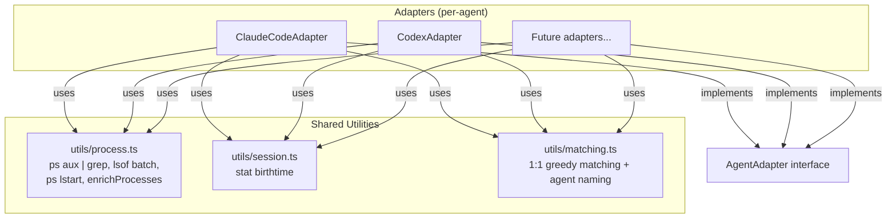
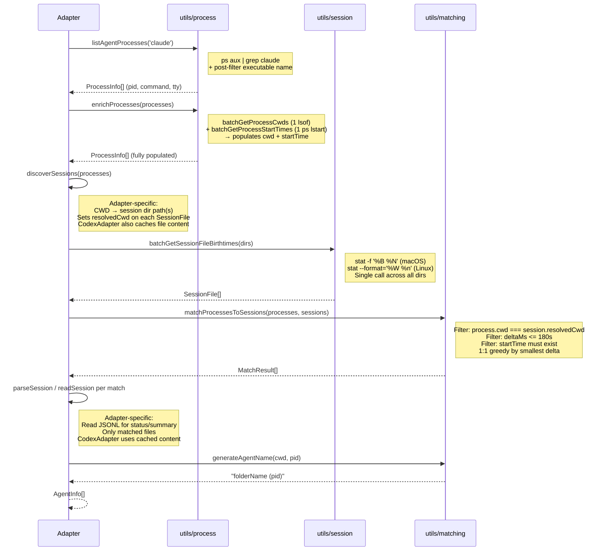

# System Design & Architecture

## Architecture Overview



Each adapter implements `AgentAdapter` (unchanged interface), owns its detection flow and session scanning, and calls shared utilities for OS-level commands and matching.

## Data Flow



## Data Models

### ProcessInfo (existing, extended)

```typescript
interface ProcessInfo {
    pid: number;
    command: string;
    cwd: string;         // populated by enrichProcesses
    tty: string;
    startTime?: Date;    // populated by enrichProcesses
}
```

Adding `startTime?: Date` to the existing `ProcessInfo` in `AgentAdapter.ts`. This is a public type change — accepted since it's additive (optional field).

### SessionFile (new, shared)

```typescript
interface SessionFile {
    sessionId: string;      // filename without .jsonl
    filePath: string;       // full path
    projectDir: string;     // parent directory
    birthtimeMs: number;    // from stat (epoch seconds × 1000 → milliseconds)
    resolvedCwd: string;    // set by adapter: the CWD this session maps to
}
```

`resolvedCwd` is set by the adapter after calling `batchGetSessionFileBirthtimes()`. This keeps the CWD↔session mapping adapter-specific while allowing the shared matcher to compare `process.cwd === session.resolvedCwd` without callbacks or maps.

### MatchResult (new, shared)

```typescript
interface MatchResult {
    process: ProcessInfo;
    session: SessionFile;
    deltaMs: number;        // |process.startTime - session.birthtimeMs|
}
```

## Component Breakdown

### `utils/process.ts` — Shell command wrappers for process data

Extended from existing file. All `execSync` calls for process data live here.

| Function | Shell command | Returns |
|----------|-------------|---------|
| `listAgentProcesses(namePattern)` | `ps aux \| grep <pattern>` + post-filter executable basename | `ProcessInfo[]` (pid, command, tty — cwd/startTime empty) |
| `batchGetProcessCwds(pids)` | `lsof -a -d cwd -Fn -p PID1,PID2,...` | `Map<number, string>` |
| `batchGetProcessStartTimes(pids)` | `ps -o pid=,lstart= -p PID1,PID2,...` | `Map<number, Date>` |
| `enrichProcesses(processes)` | Calls `batchGetProcessCwds` + `batchGetProcessStartTimes` | `ProcessInfo[]` with cwd and startTime populated |

Notes:
- `listAgentProcesses` uses `grep` at shell level for performance, then post-filters by checking `path.basename(executable)` matches exactly (avoids matching `claude-helper`, `vscode-claude-extension`, or the grep process itself)
- `enrichProcesses` is a convenience that calls both batch functions and merges results into each `ProcessInfo`. Returns partial results — if `lsof` fails for a PID, that process gets empty cwd; if `ps lstart` fails for a PID, that process gets no `startTime`
- `batchGetProcessStartTimes` uses `lstart` format (full timestamp like `Thu Feb  5 16:00:57 2026`) instead of lossy `etime`

### `utils/session.ts` — Shell command wrappers for session files

New file.

| Function | Shell command | Returns |
|----------|-------------|---------|
| `batchGetSessionFileBirthtimes(dirs)` | `stat -f '%B %N' dir1/*.jsonl dir2/*.jsonl ...` (macOS) or `stat --format='%W %n' ...` (Linux) | `SessionFile[]` |

Notes:
- Combines all directory globs into a single `stat` call
- Uses `stat` instead of `ls -lU` — gives epoch seconds (exact, no parsing ambiguity)
- Platform detection via `process.platform`
- Returns empty array if directories don't exist, have no `.jsonl` files, or command fails
- `resolvedCwd` is left empty — adapter must set it after calling this function

### `utils/matching.ts` — Shared matching algorithm and naming

New file.

| Function | Description |
|----------|-------------|
| `matchProcessesToSessions(processes, sessions)` | 1:1 greedy assignment by closest birthtimeMs |
| `generateAgentName(cwd, pid)` | Returns `basename(cwd) (pid)` |

#### Matching algorithm

```
Input:
  processes: ProcessInfo[] (with cwd and startTime populated)
  sessions: SessionFile[] (with resolvedCwd set by adapter)

1. Filter processes: exclude any where startTime is undefined
   (→ these become process-only fallback in the adapter)

2. Build candidate pairs:
   for each process P, for each session S:
     if P.cwd === S.resolvedCwd:
       deltaMs = |P.startTime - S.birthtimeMs|
       if deltaMs <= 180_000 (3 minutes):
         add (P, S, deltaMs) to candidates

3. Sort candidates by deltaMs ascending (best matches first)

4. Greedy assign:
   matchedPids = Set()
   matchedSessionIds = Set()
   results = []

   for each (P, S, deltaMs) in candidates:
     if P.pid in matchedPids → skip
     if S.sessionId in matchedSessionIds → skip
     assign P ↔ S
     results.push({ process: P, session: S, deltaMs })

5. Return results
```

Unmatched processes (no session within tolerance, or no startTime) → adapter creates process-only fallback AgentInfo.

### Per-adapter responsibilities

| Responsibility | Stays in adapter | Reason |
|---|---|---|
| `canHandle(command)` | Yes (interface contract) | Kept for interface, but `listAgentProcesses` already filters |
| Session dir scanning | Yes | Claude: `~/.claude/projects/<encoded>/`, Codex: `~/.codex/sessions/YYYY/MM/DD/` |
| CWD → session dir mapping | Yes | Adapter sets `resolvedCwd` on each SessionFile |
| Session parsing (`parseSession`/`readSession`) | Yes | JSONL schema differs per agent. CodexAdapter supports cached content to avoid double I/O. |
| `determineStatus(session)` | Yes | Entry types and status mapping differ |
| Summary extraction | Yes | Content structure differs |

#### Codex date-dir scanning

Codex stores sessions in `~/.codex/sessions/YYYY/MM/DD/*.jsonl`. The adapter will:
1. Use process start times (from `enrichProcesses`) to determine date dirs
2. Scan date directories around each process start date (±1 day window)
3. Call `batchGetSessionFileBirthtimes(dateDirs)` once with all date directories
4. Read each file once and cache content in `Map<string, string>` for later parsing
5. Set `resolvedCwd` from the session_meta first line's `cwd` field

## Design Decisions

### Adapter pattern over base class / plugin

- Adapters own their full flow and can diverge freely
- Shared logic pulled in as utility functions, not inherited
- No inversion of control — adapter calls utils, not the other way around

### birthtimeMs via `stat` over JSONL first-entry timestamp

- Zero file I/O for matching — `stat` gives epoch seconds directly
- No date format parsing ambiguity (unlike `ls -lU` which shows `MMM DD HH:MM` lossy format)
- OS-level timestamp, no app-level lag
- Dry-run validated: 6/8 exact matches, 2/8 within 3min tolerance
- Known limitation: session resumption without process restart (accepted)

### `stat` over `ls -lU`

- `ls -lU` date format is lossy — no seconds for recent files, no year for old files
- `stat -f '%B %N'` (macOS) and `stat --format='%W %n'` (Linux) give epoch seconds
- Exact timestamps, trivial to parse (split on space, `parseInt`)

### `resolvedCwd` on SessionFile over callback/map

- Adapter sets `resolvedCwd` after getting birthtimes, before calling matcher
- Matcher compares `process.cwd === session.resolvedCwd` — pure, no adapter-specific logic
- No callback indirection, no map lookup

### `enrichProcesses` convenience function

- Adapter calls `listAgentProcesses` then `enrichProcesses` — two calls instead of managing 3 separate maps
- Returns partial results — if one PID fails, others still get populated
- Processes without `startTime` are excluded from matching (→ process-only fallback)

### Greedy 1:1 over multi-pass modes

- Single greedy pass sorted by delta ascending
- Simpler, deterministic, no pass-ordering side effects
- Parent-child matching dropped — exact CWD match only

### Agent naming: `folderName (pid)`

- Deterministic, no JSONL parse needed
- PID always included for uniqueness
- Breaking change from slug-based naming — accepted

### Batched shell calls

- 1 `lsof` for all PIDs vs N per-PID calls
- 1 `ps -o lstart` for all PIDs vs N `ps -o etime` calls
- grep at shell level vs list-all-then-filter-in-code

### 3-minute tolerance

- Covers all observed deltas (23s to 2m24s) with margin
- Beyond tolerance → process-only fallback (wrong match worse than no match)

### Error handling

- Shell command utils return partial results — if lsof fails for 1 of 5 PIDs, the other 4 still return
- Future: `--verbose` mode will log matching details (which candidates were considered, why matches were rejected) to log files for debugging

## Non-Functional Requirements

- **Performance**: Detection < 500ms for 10 processes, 50 session files
- **Correctness**: Identical output for non-edge-case scenarios
- **Portability**: macOS and Linux (no Windows)
- **Testability**: Shared utils independently testable — mock `execSync` at module level with `jest.mock`
