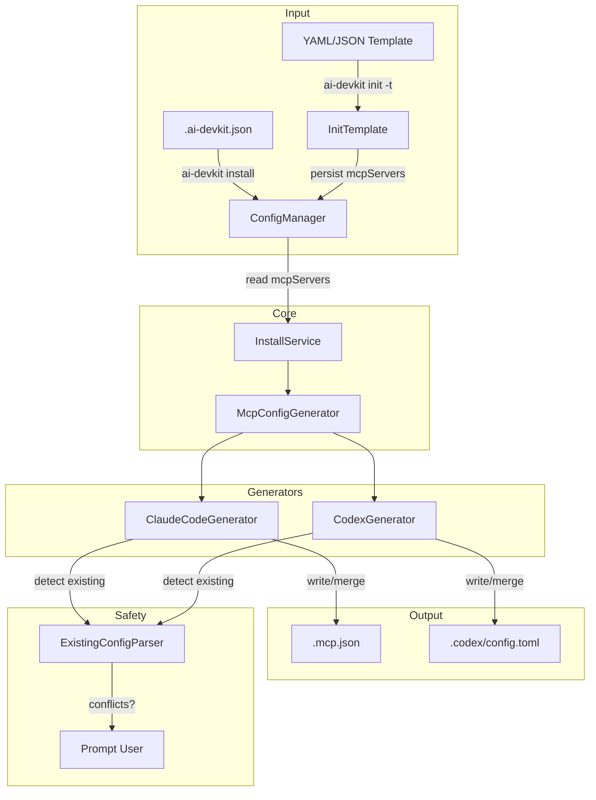

# Design: MCP Config Standardization

## Architecture Overview



**Flow:**
1. User defines `mcpServers` in `.ai-devkit.json` directly or via a YAML template (`ai-devkit init -t`)
2. `ai-devkit install` reads `mcpServers` from config
3. `McpConfigGenerator` dispatches to per-agent generators based on `config.environments`
4. Each generator reads the existing agent config (if any), computes a diff, and prompts the user before writing

## Data Models

### Universal MCP Server Schema (in `.ai-devkit.json`)

```typescript
// Added to DevKitConfig
interface DevKitConfig {
  // ... existing fields ...
  mcpServers?: Record<string, McpServerDefinition>;
}

// Universal MCP server definition
interface McpServerDefinition {
  // Transport type
  transport: 'stdio' | 'http' | 'sse';

  // stdio transport fields
  command?: string;                    // Required for stdio
  args?: string[];                     // Optional for stdio
  env?: Record<string, string>;        // Optional environment variables

  // http/sse transport fields
  url?: string;                        // Required for http/sse
  headers?: Record<string, string>;    // Optional HTTP headers (auth, etc.)
}
```

### Template Schema Extension

```typescript
// Added to InitTemplateConfig
interface InitTemplateConfig {
  // ... existing fields ...
  mcpServers?: Record<string, McpServerDefinition>;
}
```

### Example `.ai-devkit.json`

```json
{
  "version": "0.5.0",
  "environments": ["claude", "codex"],
  "phases": ["requirements", "design", "planning", "implementation", "testing"],
  "mcpServers": {
    "memory": {
      "transport": "stdio",
      "command": "npx",
      "args": ["-y", "@ai-devkit/memory"],
      "env": { "MEMORY_DB_PATH": "./memory.db" }
    },
    "filesystem": {
      "transport": "stdio",
      "command": "npx",
      "args": ["-y", "@modelcontextprotocol/server-filesystem", "./src"]
    },
    "notion": {
      "transport": "http",
      "url": "https://mcp.notion.com/mcp"
    },
    "secure-api": {
      "transport": "http",
      "url": "https://api.example.com/mcp",
      "headers": {
        "Authorization": "Bearer ${API_KEY}"
      }
    }
  }
}
```

### Example YAML Template

```yaml
environments:
  - claude
  - codex
phases:
  - requirements
  - design
  - planning
  - implementation
  - testing
skills:
  - registry: codeaholicguy/ai-devkit
    skill: memory
mcpServers:
  memory:
    transport: stdio
    command: npx
    args: ["-y", "@ai-devkit/memory"]
    env:
      MEMORY_DB_PATH: "./memory.db"
  notion:
    transport: http
    url: https://mcp.notion.com/mcp
```

## Agent-Specific Output Formats

### Claude Code (`.mcp.json`)

stdio servers omit the `type` field (inferred). HTTP/SSE servers use `"type": "http"` or `"type": "sse"`.

```json
{
  "mcpServers": {
    "memory": {
      "command": "npx",
      "args": ["-y", "@ai-devkit/memory"],
      "env": { "MEMORY_DB_PATH": "./memory.db" }
    },
    "notion": {
      "type": "http",
      "url": "https://mcp.notion.com/mcp"
    },
    "secure-api": {
      "type": "http",
      "url": "https://api.example.com/mcp",
      "headers": {
        "Authorization": "Bearer ${API_KEY}"
      }
    }
  }
}
```

**Mapping rules (universal → Claude Code):**
- `transport: "stdio"` → omit `type`, emit `command`/`args`/`env`
- `transport: "http"` → `"type": "http"`, emit `url`/`headers`
- `transport: "sse"` → `"type": "sse"`, emit `url`/`headers`
- `headers` → `headers` (direct pass-through)

### Codex (`.codex/config.toml`)

```toml
[mcp_servers.memory]
command = "npx"
args = ["-y", "@ai-devkit/memory"]

[mcp_servers.memory.env]
MEMORY_DB_PATH = "./memory.db"

[mcp_servers.notion]
url = "https://mcp.notion.com/mcp"

[mcp_servers.secure-api]
url = "https://api.example.com/mcp"

[mcp_servers.secure-api.http_headers]
Authorization = "Bearer ${API_KEY}"
```

**Mapping rules (universal → Codex):**
- `transport: "stdio"` → emit `command`/`args`; `env` as `[mcp_servers.<name>.env]` table
- `transport: "http"` or `"sse"` → emit `url`; `headers` as `[mcp_servers.<name>.http_headers]` table
- Codex-specific fields (`startup_timeout_sec`, `enabled_tools`, etc.) are not generated in v1

## Component Breakdown

### 1. Schema & Validation (`types.ts` + `InitTemplate.ts`)
- `McpTransport` type and `McpServerDefinition` interface in `types.ts`
- `mcpServers` added to `DevKitConfig` (optional)
- `mcpServers` added to `InitTemplateConfig` and `ALLOWED_TEMPLATE_FIELDS`
- Validation extracted to `validateMcpServers()` and `validateStringRecord()` helpers
- Validate: transport required (`stdio`|`http`|`sse`), stdio requires `command`, http/sse requires `url`, `headers` optional for http/sse

### 2. ConfigManager (`lib/Config.ts`)
- No code changes needed — existing generic `update()`/`read()` handles `mcpServers` via the updated `DevKitConfig` type

### 3. MCP Generators (`services/install/mcp/`)

```
services/install/mcp/
├── index.ts                    # Re-exports: installMcpServers, McpInstallOptions, McpInstallReport
├── types.ts                    # McpAgentGenerator interface, McpMergePlan, McpInstallReport
├── BaseMcpGenerator.ts         # Abstract base: shared plan() + apply() diff-and-merge logic
├── McpConfigGenerator.ts       # Orchestrator: dispatch to generators, conflict resolution, CI mode
├── ClaudeCodeMcpGenerator.ts   # .mcp.json: toAgentFormat + read/write JSON
└── CodexMcpGenerator.ts        # .codex/config.toml: toAgentFormat + read/write TOML
```

**Key interfaces:**
```typescript
interface McpAgentGenerator {
  readonly agentType: EnvironmentCode;
  plan(servers: Record<string, McpServerDefinition>, projectRoot: string): Promise<McpMergePlan>;
  apply(plan: McpMergePlan, servers: Record<string, McpServerDefinition>, projectRoot: string): Promise<void>;
}

interface McpMergePlan {
  agentType: EnvironmentCode;
  newServers: string[];
  conflictServers: string[];
  skippedServers: string[];
  resolvedConflicts: string[];  // filled after user prompt or --overwrite
}
```

**`BaseMcpGenerator`** provides shared `plan()` and `apply()` logic. Subclasses implement three abstract methods:
- `toAgentFormat(def)` — convert universal schema to agent-native format
- `readExistingServers(projectRoot)` — read and parse agent config file
- `writeServers(projectRoot, mergedServers)` — serialize and write back

### 4. Merge & Conflict Resolution
- **Comparison**: `deepEqual()` (shared util at `util/object.ts`) on agent-format output
- **Interactive mode**: prompt user with skip all / overwrite all / choose per server
- **Non-interactive (CI)**: `--overwrite` flag → overwrite all; default → skip all conflicts
- **TTY detection**: `isInteractiveTerminal()` (shared util at `util/terminal.ts`)
- **Preservation**: both generators read the full config, modify only MCP server entries, and preserve all other content

### 5. Install Service Extension (`services/install/install.service.ts`)
- Calls `installMcpServers()` after skills install, passing `{ overwrite }` from CLI options
- Uses union of existing + newly installed environments to determine which generators to run
- `McpInstallReport` added to `InstallReport` (installed/skipped/conflicts/failed counts)
- Persists `mcpServers` to `.ai-devkit.json` via `configManager.update()`

### 6. Install Config Validation (`util/config.ts`)
- `mcpServers` added to `InstallConfigData` with Zod schema validation
- Defaults to `{}` when absent — existing configs work unchanged

### 7. Init Command (`commands/init.ts`)
- Persists `mcpServers` from template to `.ai-devkit.json` after skills install
- Displays count and suggests running `ai-devkit install` to generate agent configs

## Design Decisions

| Decision | Choice | Rationale |
|----------|--------|-----------|
| Config location | `mcpServers` in `.ai-devkit.json` | Single source of truth, no new files |
| Transport field | Explicit `transport: 'stdio' \| 'http' \| 'sse'` | Clear intent, easy validation; maps to agent-specific format per generator |
| `http` naming | Use `http` not `streamable-http` | Matches Claude Code's `type: "http"` convention; shorter; the MCP spec calls it "Streamable HTTP" but agents use `http` |
| SSE support | Include but mark deprecated | SSE is deprecated in MCP spec (replaced by streamable-http) but some servers still use it |
| Merge strategy | Additive with prompt on conflict | Prevents data loss, respects user customizations |
| CI / non-interactive | Skip conflicts by default, overwrite with `--overwrite` | Safe default for CI pipelines; no hanging prompts |
| TOML library | `smol-toml` | Codex config needs both read and write; `smol-toml` handles nested tables correctly |
| Generator pattern | Abstract base class + subclasses | Shared plan/apply logic in `BaseMcpGenerator`; subclasses only provide format-specific I/O |
| Scope | Project-level only | `.mcp.json` for Claude Code, `.codex/config.toml` for Codex — no user-level configs |

## Non-Functional Requirements

- **Performance**: Config generation is fast (file I/O only, no network)
- **Safety**: Never silently overwrite existing configs; prompt in interactive mode, skip in CI
- **Extensibility**: Adding a new agent generator requires only a new subclass of `BaseMcpGenerator`
