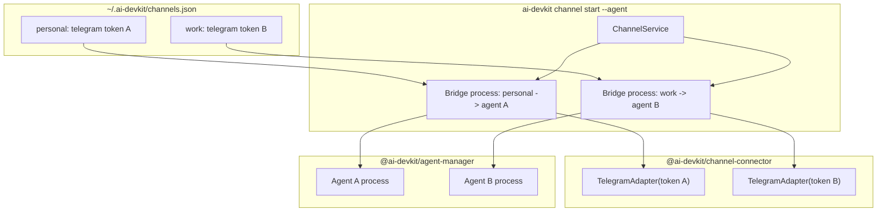

# System Design: Multi Telegram Channels

## Architecture Overview

The current channel architecture remains valid: channel-connector is a pure message pipe, and CLI owns agent orchestration. This feature changes the CLI and config identity model from a single implicit `telegram` channel to named channel instances.



### Key Principles

- A **channel instance** is identified by a user-facing name such as `personal` or `work`.
- Each channel instance has one channel type, one Telegram bot token, and one authorization scope.
- Each running bridge process maps one channel instance to one agent process.
- Multiple bridge processes are allowed when their channel names differ.
- `@ai-devkit/channel-connector` remains unaware of agents and channel names beyond adapter construction.

## Data Models

### Channel Configuration

Keep the existing map shape and make channel names first-class:

```typescript
interface ChannelConfig {
  channels: Record<string, ChannelEntry>;
}

interface ChannelEntry {
  type: 'telegram' | 'slack' | 'whatsapp';
  enabled: boolean;
  createdAt: string;
  updatedAt?: string;
  config: TelegramConfig;
}

interface TelegramConfig {
  botToken: string;
  botUsername: string;
  authorizedChatId?: number;
}
```

Compatibility rule: if an existing config has only `channels.telegram`, it is treated as a named channel instance called `telegram`.

### Bridge Process Metadata

Store a small runtime file for channel bridge processes. Do not overload agent session utilities, because they describe historical agent sessions rather than currently running channel bridge processes.

```typescript
interface ChannelBridgeProcess {
  channelName: string;
  channelType: 'telegram';
  agentName: string;
  agentPid: number;
  bridgePid: number;
  startedAt: string;
}
```

Store this metadata in a small registry file such as `~/.ai-devkit/channel-bridges.json`. Do not persist bot tokens or transcript content in process metadata.

Status commands should treat registry entries as advisory and verify liveness with a PID check before reporting a bridge as running. Stale entries are removed when detected.

## API Design

### CLI Commands

```bash
ai-devkit channel connect telegram --name <name>
ai-devkit channel list
ai-devkit channel disconnect <name>
ai-devkit channel start <name> --agent <agent-name>
ai-devkit channel status [<name>]
```

Backwards compatibility:

```bash
ai-devkit channel connect telegram
ai-devkit channel disconnect telegram
ai-devkit channel start --agent <agent-name>
```

When `connect telegram` is called without `--name`:

- Create or update the default `telegram` channel entry.

When `start` is called without a name, use `telegram` if it exists and there is only one configured Telegram channel. If multiple Telegram channels exist, require an explicit name.

Commander shape:

```typescript
channelCommand
  .command('connect <type>')
  .option('--name <name>', 'Channel instance name')

channelCommand
  .command('start [name]')
  .requiredOption('--agent <name>', 'Name of the agent to bridge')

channelCommand
  .command('status [name]')
```

### ConfigStore

The current `ConfigStore` API already supports named entries:

```typescript
saveChannel(name: string, entry: ChannelEntry): Promise<void>;
removeChannel(name: string): Promise<void>;
getChannel(name: string): Promise<ChannelEntry | undefined>;
```

Implementation should validate names before saving and avoid special-casing channel type as the config key.

CLI should reject duplicate Telegram bot tokens across different channel names before saving a channel. The check compares the target token against every other configured Telegram channel, excluding the channel being updated.

### Channel Service

Create a focused CLI service boundary for channel rules and foreground bridge process metadata. `ChannelService` owns the runtime bridge file directly; no separate bridge registry abstraction is needed until daemon support creates real pressure for one.

```typescript
class ChannelService {
  resolveConnectChannelName(name?: string): string;
  assertUniqueTelegramToken(config: ChannelConfig, targetName: string, botToken: string): void;
  resolveStartChannelName(config: ChannelConfig, name?: string): string;
  getLiveBridges(): Promise<ChannelBridgeProcess[]>;
  getLiveBridgeByChannel(channelName: string): Promise<ChannelBridgeProcess | undefined>;
  registerBridge(process: ChannelBridgeProcess): Promise<void>;
  unregisterBridge(channelName: string): Promise<void>;
}
```

The service checks whether `bridgePid` is still alive and removes stale entries. This lets `channel status` distinguish configured channels from actively running bridge processes without introducing daemon lifecycle management. The bridge file is intentionally platform-neutral: `channelType` can be `telegram`, `slack`, `discord`, or another adapter type in the future, while platform-specific secrets stay in `channels.json`.

### Runtime Routing

For each started channel instance, CLI creates an isolated bridge context:

```typescript
interface BridgeContext {
  channelName: string;
  agent: AgentInfo;
  adapter: TelegramAdapter;
  activeChatId: string | null;
  lastMessageCount: number;
}
```

The message handler and output polling loop close over this context, preventing cross-channel delivery.

On bridge start, `activeChatId` is initialized from the selected channel entry's `authorizedChatId` when present. On the first accepted incoming message for a channel without an authorized chat ID, CLI saves that chat ID back to the same channel entry. This keeps authorization scoped per channel and stable across restarts.

## Component Breakdown

### `packages/channel-connector`
- No broad architecture change.
- Ensure `ConfigStore` correctly preserves arbitrary channel names.
- Ensure Telegram authorization state is stored per channel instance.
- Add tests for multiple named entries with different tokens and chat IDs.

### `packages/cli/src/commands/channel.ts`
- Parse channel instance names for `start`, `disconnect`, and `status`.
- Add `--name` to `connect telegram`.
- Use `telegram` as the default channel name when connecting without `--name`.
- Reject duplicate Telegram bot tokens across different channel names.
- Resolve ambiguous default behavior.
- Start bridge contexts using the selected channel config.
- Register or report running bridge process status per channel name.

### `packages/cli/src/services/channel/`
- Add `channel.service.ts` for channel naming, duplicate-token validation, bridge lookup, and command-facing channel rules.
- Store foreground bridge metadata in `~/.ai-devkit/channel-bridges.json` from `ChannelService`.
- Track active foreground bridge processes by channel name.
- Prune stale bridge PIDs before reporting status or starting a bridge.
- Keep existing agent session utilities unchanged.

## Design Decisions

1. **Named channel instances instead of type-only config keys**
   - Reason: users need multiple Telegram configs, all with the same type but different tokens.

2. **One bridge process per channel-agent mapping**
   - Reason: matches the existing foreground process model and isolates long polling, chat authorization, and output polling.

3. **Require explicit channel name when multiple configs exist**
   - Reason: avoids accidentally sending a bot token or agent messages through the wrong channel.

4. **Reject duplicate Telegram tokens**
   - Reason: concurrent long polling for the same Telegram bot token can conflict and route messages unpredictably.

5. **Use a channel service boundary**
   - Reason: channel behavior now includes naming rules, duplicate-token policy, runtime bridge metadata, and future daemon integration. Keeping this behind `ChannelService` avoids putting business rules in Commander actions or generic utilities.

6. **Persist authorized chat ID per channel**
   - Reason: each Telegram bot should keep its own authorization scope across restarts, and one channel's first user must not affect another channel.

7. **No channel-connector dependency on agent-manager**
   - Reason: preserves the design boundary from `feature-channel-connector`.

## Non-Functional Requirements

### Security
- Never print bot tokens.
- Store config file with mode `0600`.
- Keep authorized chat ID scoped per channel name.
- Store bridge metadata without bot tokens.
- Do not persist agent transcript content in channel process metadata.

### Reliability
- Failure in one bridge process must not stop other bridge processes.
- Starting an already-running channel name should fail clearly.
- Stale bridge metadata entries should be pruned before status/start decisions.
- SIGINT/SIGTERM cleanup should unregister only the current channel bridge process.
- Managed `channel stop <name>` behavior is out of scope until daemon support exists.

### Performance
- Per-bridge polling behavior should remain equivalent to current channel start behavior.
- Running multiple bridges should scale linearly with the number of channels and active agents.

### Compatibility
- Existing `channels.telegram` config remains usable as the `telegram` channel instance.
- Existing commands without names continue to work when unambiguous.
