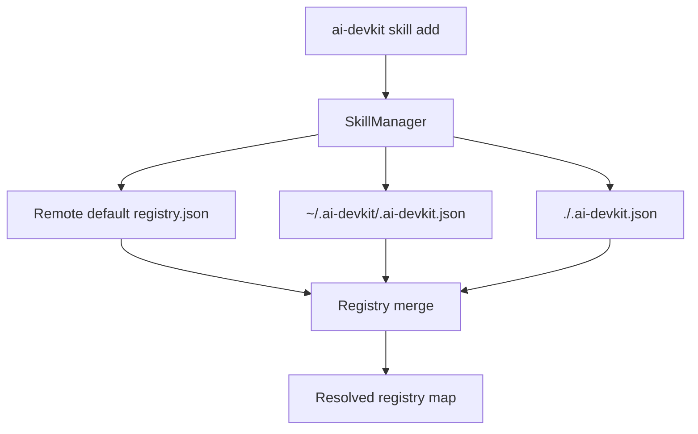

# System Design & Architecture

## Architecture Overview

- `SkillManager.fetchMergedRegistry` remains the single merge point.
- `ConfigManager` adds project registry extraction.
- Merge order is implemented as object spread with source ordering.

## Data Models
- Registry map shape: `Record<string, string>`.
- Project registry extraction supports:
  - `registries` at root.
  - `skills.registries` when `skills` is an object.

## API Design
- `ConfigManager.getSkillRegistries(): Promise<Record<string, string>>`.
- `SkillManager.fetchMergedRegistry()` now merges three sources.

## Component Breakdown
- `packages/cli/src/lib/Config.ts`: parse project registry mappings.
- `packages/cli/src/lib/SkillManager.ts`: apply precedence order.
- Tests:
  - `packages/cli/src/__tests__/lib/Config.test.ts`
  - `packages/cli/src/__tests__/lib/SkillManager.test.ts`

## Design Decisions
- Keep merge logic centralized in `SkillManager` to avoid drift.
- Keep parser tolerant to allow gradual config evolution.
- Favor project determinism by applying project map last.

## Non-Functional Requirements
- No additional network calls.
- No change to failure mode when default registry fetch fails (still supports fallback sources).
