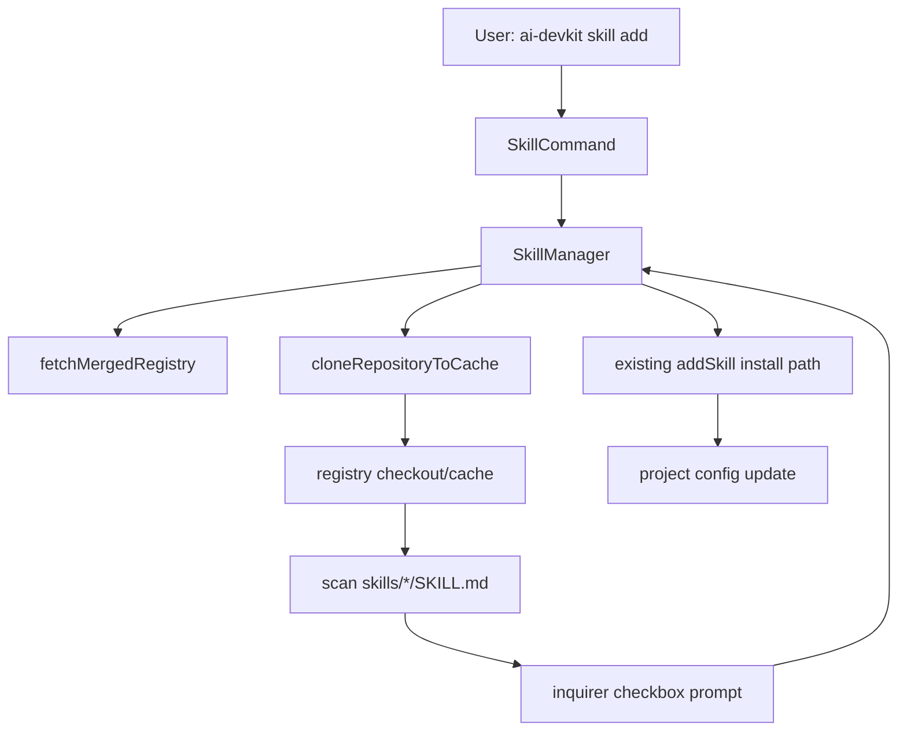

# System Design & Architecture - Skill Add Interactive Selection

## Architecture Overview
**What is the high-level system structure?**



- `packages/cli/src/commands/skill.ts` will change `add` from two required args to one required registry arg plus an optional skill arg.
- `SkillManager` will own the interactive fallback so CLI wiring stays thin and existing validation/cache logic is reused.
- The prompt list will be built from the selected registry checkout after registry resolution; if refresh fails but cache exists, the cached checkout is still used with a warning.

## Data Models
**What data do we need to manage?**

```ts
interface RegistrySkillChoice {
  name: string;
  description?: string;
}

interface AddSkillOptions {
  global?: boolean;
  environments?: string[];
}
```

- `RegistrySkillChoice` is an internal prompt model only.
- The persisted config format does not change.
- Skill names continue to be the canonical installation IDs.

## API Design
**How do components communicate?**

**CLI surface:**

- Existing explicit form remains:
  - `ai-devkit skill add <registry> <skill-name>`
- New interactive shorthand:
  - `ai-devkit skill add <registry>`

**Internal interfaces (proposed):**

```ts
async addSkill(registryId: string, skillName?: string, options?: AddSkillOptions): Promise<void>;
async listRegistrySkills(registryId: string): Promise<RegistrySkillChoice[]>;
async promptForSkillSelection(skills: RegistrySkillChoice[]): Promise<string[]>;
```

**Behavior contract:**

- If `skillName` is provided, skip prompting.
- If `skillName` is missing and `stdout`/`stdin` are interactive, enumerate skills and prompt for one or more selections.
- If `skillName` is missing in a non-interactive context, fail with an error instructing the user to provide `<skill-name>`.
- If the prompt is cancelled, exit without side effects.
- If exactly one valid skill exists and `skillName` is omitted, still show the selector instead of auto-installing.

## Component Breakdown
**What are the major building blocks?**

1. `packages/cli/src/commands/skill.ts`
   - Update the command signature to optional `[skill-name]`.
   - Pass control to `SkillManager.addSkill`.
2. `packages/cli/src/lib/SkillManager.ts`
   - Split current `addSkill` flow into:
     - registry resolution and cache preparation
     - optional interactive skill selection
     - existing installation logic
   - Add a helper that enumerates valid skills from the cloned registry.
   - Add a helper that prompts with `inquirer`.
   - Reuse the existing install path for each selected skill.
3. `packages/cli/src/__tests__/commands/skill.test.ts`
   - Add command-level coverage for omitted skill name.
4. `packages/cli/src/__tests__/lib/SkillManager.test.ts`
   - Add behavior coverage for enumeration, prompt selection, cancellation, and non-interactive mode.

## Design Decisions
**Why did we choose this approach?**

- Enumerate from the resolved registry checkout instead of the global search index:
  - It guarantees the list reflects the exact target registry the user requested.
  - It works with custom registries that may not yet be indexed.
  - It avoids coupling install behavior to index freshness.
- Keep interactive selection explicit even for single-skill registries:
  - It matches the stated UX requirement.
  - It avoids hidden behavior changes between one-skill and multi-skill registries.
- Allow multi-select installation in the prompt:
  - It reduces repetitive command invocations when a user wants several skills from the same registry.
  - It keeps the explicit two-argument command unchanged for scripted single-skill installs.
- Prefer cached registry contents when refresh fails:
  - It keeps the command usable offline or during transient network failures.
  - It aligns with existing cache-oriented registry behavior.
- Keep the prompt in `SkillManager`:
  - Registry validation, caching, and installation already live there.
  - The command layer should not duplicate repo-reading logic.
- Fail in non-interactive mode when the skill name is omitted:
  - This preserves scriptability and avoids hanging CI jobs.

**Alternatives considered:**

- Use `skill find` index results to populate the prompt.
  - Rejected because it is broader than the selected registry and may be stale.
- Always auto-install when a registry has exactly one skill.
  - Rejected for now to keep behavior explicit and predictable.

## Non-Functional Requirements
**How should the system perform?**

- Performance:
  - Interactive enumeration should reuse the existing cache and only fetch/update the chosen registry once.
- Reliability:
  - Invalid skill folders are skipped during enumeration instead of breaking the entire list.
  - Empty registries produce a clear error.
  - Refresh failures degrade to cached registry contents when available.
- Security:
  - Continue validating `registryId` and selected `skillName` before installation.
- Usability:
  - Prompt entries should display skill name and short description when available.
  - Users should be able to select multiple skills in one prompt.
