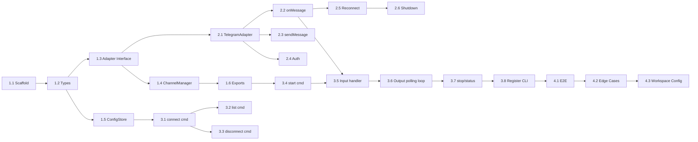

# Planning: Channel Connector

## Milestones

- [x] Milestone 1: Package scaffold and core abstractions
- [x] Milestone 2: Telegram adapter (send/receive messages via callback)
- [x] Milestone 3: CLI channel commands and agent bridge
- [ ] Milestone 4: End-to-end flow working

## Task Breakdown

### Phase 1: Package Foundation
- [x] Task 1.1: Scaffold `packages/channel-connector` package (package.json, tsconfig, jest config, nx project config)
- [x] Task 1.2: Define core types (`IncomingMessage`, `MessageHandler`, `ChannelConfig`, `ChannelEntry`, `TelegramConfig`)
- [x] Task 1.3: Implement `ChannelAdapter` interface
- [x] Task 1.4: Implement `ChannelManager` (adapter registration, lifecycle start/stop)
- [x] Task 1.5: Implement `ConfigStore` (read/write `~/.ai-devkit/channels.json`, file permissions)
- [x] Task 1.6: Add `index.ts` public exports

### Phase 2: Telegram Adapter
- [x] Task 2.1: Add `telegraf` dependency, implement `TelegramAdapter` (connect, long polling, map telegraf context to `IncomingMessage`)
- [x] Task 2.2: Implement `onMessage` — call registered handler (fire-and-forget, void return)
- [x] Task 2.3: Implement `sendMessage` with message chunking — split at 4096 chars preferring newline boundaries
- [x] Task 2.4: Implement chat authorization (auto-authorize first user, reject others)
- [ ] Task 2.5: Implement auto-reconnect with exponential backoff (deferred — telegraf handles basic reconnect)
- [x] Task 2.6: Implement graceful shutdown (SIGINT/SIGTERM handling in CLI)

### Phase 3: CLI Integration
- [x] Task 3.1: Create `channel connect telegram` command (interactive bot token setup, validation, persist via ConfigStore)
- [x] Task 3.2: Create `channel list` command (show configured channels with status)
- [x] Task 3.3: Create `channel disconnect telegram` command (remove config)
- [x] Task 3.4: Create `channel start --agent <agent-name>` command — resolve agent by name, instantiate channel-connector, wire input handler and output loop
- [x] Task 3.5: Implement input handler in CLI — capture chatId from first message, fire-and-forget to agent via TtyWriter
- [x] Task 3.6: Implement output polling loop in CLI — poll `getConversation()` from agent-manager, detect new assistant messages, push to tracked chatId via `sendMessage()`
- [x] Task 3.7: Create `channel status` command
- [x] Task 3.8: Register channel commands in CLI entry point (`cli.ts`)

### Phase 4: Integration & Polish
- [ ] Task 4.1: End-to-end testing — connect Telegram, send message, verify agent receives and responds
- [x] Task 4.2: Handle edge cases — unauthorized user rejection, invalid token validation, handler errors
- [x] Task 4.3: Update root workspace config (package.json workspaces — already included via packages/*)

## Dependencies

### External Dependencies
- `telegraf` — Telegram Bot API library (channel-connector package)
- `@ai-devkit/agent-manager` — agent discovery and terminal I/O (CLI only, NOT in channel-connector)
- `@ai-devkit/channel-connector` — messaging bridge (CLI dependency)

## Timeline & Estimates

| Phase | Tasks | Effort |
|-------|-------|--------|
| Phase 1: Foundation | 6 tasks | Small |
| Phase 2: Telegram | 6 tasks | Medium |
| Phase 3: CLI | 8 tasks | Medium |
| Phase 4: Polish | 3 tasks | Small |

## Risks & Mitigation

| Risk | Impact | Mitigation |
|------|--------|------------|
| Agent response capture is unreliable (CLI responsibility) | Core feature broken | Evaluate agent-manager's `getConversation()` first; fallback to terminal monitoring |
| Telegraf API changes | Build breaks | Pin telegraf version, use stable API surface |
| TtyWriter limitations | Can't send to all agent types | Start with Claude Code (best supported), document limitations |
| Long-polling reliability | Missed messages | Implement reconnect with backoff in TelegramAdapter |

## Resources Needed

- **NPM package**: `telegraf` (Telegram Bot API)
- **Telegram Bot**: Created via BotFather (developer provides token)
- **Existing packages**: `@ai-devkit/agent-manager` (used by CLI, not by channel-connector)
