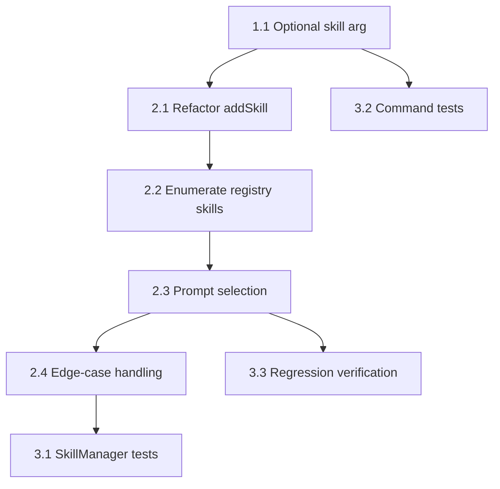

# Project Planning & Task Breakdown - Skill Add Interactive Selection

## Milestones
**What are the major checkpoints?**

- [x] Milestone 1: Command contract updated to allow omitted skill name without breaking explicit installs.
- [x] Milestone 2: `SkillManager` can enumerate registry skills and prompt for one interactively.
- [x] Milestone 3: Tests cover prompt and non-prompt flows, plus failure cases.

## Task Breakdown
**What specific work needs to be done?**

### Phase 1: Command Surface
- [x] Task 1.1: Update `packages/cli/src/commands/skill.ts` so `add` accepts `[skill-name]`.
- [x] Task 1.2: Update command descriptions/help text to document the interactive shorthand.

### Phase 2: Interactive Selection Flow
- [x] Task 2.1: Refactor `SkillManager.addSkill` so it can resolve a missing skill name before install.
- [x] Task 2.2: Implement registry skill enumeration from the cloned/cached repository.
- [x] Task 2.3: Implement an `inquirer` selection prompt with skill name and short description labels.
- [x] Task 2.4: Handle cancel, empty registry, invalid registry, and non-interactive contexts cleanly.

### Phase 3: Validation & Regression Coverage
- [x] Task 3.1: Add `SkillManager` unit tests for enumeration and prompt behavior.
- [x] Task 3.2: Add command-level tests for `ai-devkit skill add <registry>` and explicit two-arg installs.
- [x] Task 3.3: Verify no regression in config updates and environment resolution after interactive selection.

## Dependencies
**What needs to happen in what order?**

## Timeline & Estimates
**When will things be done?**

- Phase 1: completed
- Phase 2: completed
- Phase 3: completed
- Total implementation effort: completed within the current session

## Risks & Mitigation
**What could go wrong?**

- Risk: Some registries contain nested or malformed skill directories.
  - Mitigation: enumerate only folders containing `SKILL.md` and skip invalid entries.
- Risk: Prompt behavior makes CI jobs hang.
  - Mitigation: detect non-interactive execution and require explicit `<skill-name>`.
- Risk: Refactoring `addSkill` accidentally changes direct-install behavior.
  - Mitigation: keep installation steps intact after skill resolution and add regression tests for the two-arg path.

## Resources Needed
**What do we need to succeed?**

- Existing `inquirer` dependency already used across the CLI.
- Existing `SkillManager` cache and registry resolution helpers.
- Jest command/lib test suites for regression coverage.

## Progress Summary
Implementation is complete for the current scope. The `skill add` command now accepts an omitted skill name, `SkillManager` resolves available skills from the target registry checkout with cached fallback on refresh failure, and targeted Jest coverage verifies direct install, interactive multi-selection, cancellation, non-interactive failure, and cache-backed selection behavior. Remaining lifecycle work should move to implementation review rather than additional Phase 4 coding unless new scope is introduced.
